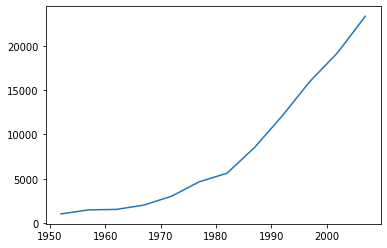

# 데이터 로드

***mpg 데이터***


```python
import pandas as pd
mpg=pd.read_csv('/content/drive/MyDrive/mpg.csv')
mpg.head()
```


  <div id="df-b52facc8-ead3-4887-9700-414d3b44ff18">
    <div class="colab-df-container">
      <div>
<style scoped>
    .dataframe tbody tr th:only-of-type {
        vertical-align: middle;
    }

    .dataframe tbody tr th {
        vertical-align: top;
    }

    .dataframe thead th {
        text-align: right;
    }
</style>
<table border="1" class="dataframe">
  <thead>
    <tr style="text-align: right;">
      <th></th>
      <th>manufacturer</th>
      <th>model</th>
      <th>displ</th>
      <th>year</th>
      <th>cyl</th>
      <th>trans</th>
      <th>drv</th>
      <th>cty</th>
      <th>hwy</th>
      <th>fl</th>
      <th>category</th>
    </tr>
  </thead>
  <tbody>
    <tr>
      <th>0</th>
      <td>audi</td>
      <td>a4</td>
      <td>1.8</td>
      <td>1999</td>
      <td>4</td>
      <td>auto(l5)</td>
      <td>f</td>
      <td>18</td>
      <td>29</td>
      <td>p</td>
      <td>compact</td>
    </tr>
    <tr>
      <th>1</th>
      <td>audi</td>
      <td>a4</td>
      <td>1.8</td>
      <td>1999</td>
      <td>4</td>
      <td>manual(m5)</td>
      <td>f</td>
      <td>21</td>
      <td>29</td>
      <td>p</td>
      <td>compact</td>
    </tr>
    <tr>
      <th>2</th>
      <td>audi</td>
      <td>a4</td>
      <td>2.0</td>
      <td>2008</td>
      <td>4</td>
      <td>manual(m6)</td>
      <td>f</td>
      <td>20</td>
      <td>31</td>
      <td>p</td>
      <td>compact</td>
    </tr>
    <tr>
      <th>3</th>
      <td>audi</td>
      <td>a4</td>
      <td>2.0</td>
      <td>2008</td>
      <td>4</td>
      <td>auto(av)</td>
      <td>f</td>
      <td>21</td>
      <td>30</td>
      <td>p</td>
      <td>compact</td>
    </tr>
    <tr>
      <th>4</th>
      <td>audi</td>
      <td>a4</td>
      <td>2.8</td>
      <td>1999</td>
      <td>6</td>
      <td>auto(l5)</td>
      <td>f</td>
      <td>16</td>
      <td>26</td>
      <td>p</td>
      <td>compact</td>
    </tr>
  </tbody>
</table>
</div>
      <button class="colab-df-convert" onclick="convertToInteractive('df-b52facc8-ead3-4887-9700-414d3b44ff18')"
              title="Convert this dataframe to an interactive table."
              style="display:none;">

  <svg xmlns="http://www.w3.org/2000/svg" height="24px"viewBox="0 0 24 24"
       width="24px">
    <path d="M0 0h24v24H0V0z" fill="none"/>
    <path d="M18.56 5.44l.94 2.06.94-2.06 2.06-.94-2.06-.94-.94-2.06-.94 2.06-2.06.94zm-11 1L8.5 8.5l.94-2.06 2.06-.94-2.06-.94L8.5 2.5l-.94 2.06-2.06.94zm10 10l.94 2.06.94-2.06 2.06-.94-2.06-.94-.94-2.06-.94 2.06-2.06.94z"/><path d="M17.41 7.96l-1.37-1.37c-.4-.4-.92-.59-1.43-.59-.52 0-1.04.2-1.43.59L10.3 9.45l-7.72 7.72c-.78.78-.78 2.05 0 2.83L4 21.41c.39.39.9.59 1.41.59.51 0 1.02-.2 1.41-.59l7.78-7.78 2.81-2.81c.8-.78.8-2.07 0-2.86zM5.41 20L4 18.59l7.72-7.72 1.47 1.35L5.41 20z"/>
  </svg>
      </button>

  <style>
    .colab-df-container {
      display:flex;
      flex-wrap:wrap;
      gap: 12px;
    }

    .colab-df-convert {
      background-color: #E8F0FE;
      border: none;
      border-radius: 50%;
      cursor: pointer;
      display: none;
      fill: #1967D2;
      height: 32px;
      padding: 0 0 0 0;
      width: 32px;
    }

    .colab-df-convert:hover {
      background-color: #E2EBFA;
      box-shadow: 0px 1px 2px rgba(60, 64, 67, 0.3), 0px 1px 3px 1px rgba(60, 64, 67, 0.15);
      fill: #174EA6;
    }

    [theme=dark] .colab-df-convert {
      background-color: #3B4455;
      fill: #D2E3FC;
    }

    [theme=dark] .colab-df-convert:hover {
      background-color: #434B5C;
      box-shadow: 0px 1px 3px 1px rgba(0, 0, 0, 0.15);
      filter: drop-shadow(0px 1px 2px rgba(0, 0, 0, 0.3));
      fill: #FFFFFF;
    }
  </style>

      <script>
        const buttonEl =
          document.querySelector('#df-b52facc8-ead3-4887-9700-414d3b44ff18 button.colab-df-convert');
        buttonEl.style.display =
          google.colab.kernel.accessAllowed ? 'block' : 'none';

        async function convertToInteractive(key) {
          const element = document.querySelector('#df-b52facc8-ead3-4887-9700-414d3b44ff18');
          const dataTable =
            await google.colab.kernel.invokeFunction('convertToInteractive',
                                                     [key], {});
          if (!dataTable) return;

          const docLinkHtml = 'Like what you see? Visit the ' +
            '<a target="_blank" href=https://colab.research.google.com/notebooks/data_table.ipynb>data table notebook</a>'
            + ' to learn more about interactive tables.';
          element.innerHTML = '';
          dataTable['output_type'] = 'display_data';
          await google.colab.output.renderOutput(dataTable, element);
          const docLink = document.createElement('div');
          docLink.innerHTML = docLinkHtml;
          element.appendChild(docLink);
        }
      </script>
    </div>
  </div>


`컬럼 설명`
- manufacturer : 제조 회사
- displ : 배기량
- cyl : 실린더 개수
- drv : 구동 방식
- hwy : 고속도로 연비
- class : 자동차 종류
- model : 자동차 모델명
- year : 생산연도
- trans : 변속기 종류
- cty : 도시 연비
- fl : 연료 종류
- category : 카테고리

***gapminder 데이터***


```python
gap = pd.read_csv('/content/drive/MyDrive/gapminder.tsv',sep='\t')
gap.head()
```


  <div id="df-c7af3365-e43a-41c2-9b50-e980ec37680e">
    <div class="colab-df-container">
      <div>
<style scoped>
    .dataframe tbody tr th:only-of-type {
        vertical-align: middle;
    }

    .dataframe tbody tr th {
        vertical-align: top;
    }

    .dataframe thead th {
        text-align: right;
    }
</style>
<table border="1" class="dataframe">
  <thead>
    <tr style="text-align: right;">
      <th></th>
      <th>country</th>
      <th>continent</th>
      <th>year</th>
      <th>lifeExp</th>
      <th>pop</th>
      <th>gdpPercap</th>
    </tr>
  </thead>
  <tbody>
    <tr>
      <th>0</th>
      <td>Afghanistan</td>
      <td>Asia</td>
      <td>1952</td>
      <td>28.801</td>
      <td>8425333</td>
      <td>779.445314</td>
    </tr>
    <tr>
      <th>1</th>
      <td>Afghanistan</td>
      <td>Asia</td>
      <td>1957</td>
      <td>30.332</td>
      <td>9240934</td>
      <td>820.853030</td>
    </tr>
    <tr>
      <th>2</th>
      <td>Afghanistan</td>
      <td>Asia</td>
      <td>1962</td>
      <td>31.997</td>
      <td>10267083</td>
      <td>853.100710</td>
    </tr>
    <tr>
      <th>3</th>
      <td>Afghanistan</td>
      <td>Asia</td>
      <td>1967</td>
      <td>34.020</td>
      <td>11537966</td>
      <td>836.197138</td>
    </tr>
    <tr>
      <th>4</th>
      <td>Afghanistan</td>
      <td>Asia</td>
      <td>1972</td>
      <td>36.088</td>
      <td>13079460</td>
      <td>739.981106</td>
    </tr>
  </tbody>
</table>
</div>
      <button class="colab-df-convert" onclick="convertToInteractive('df-c7af3365-e43a-41c2-9b50-e980ec37680e')"
              title="Convert this dataframe to an interactive table."
              style="display:none;">

  <svg xmlns="http://www.w3.org/2000/svg" height="24px"viewBox="0 0 24 24"
       width="24px">
    <path d="M0 0h24v24H0V0z" fill="none"/>
    <path d="M18.56 5.44l.94 2.06.94-2.06 2.06-.94-2.06-.94-.94-2.06-.94 2.06-2.06.94zm-11 1L8.5 8.5l.94-2.06 2.06-.94-2.06-.94L8.5 2.5l-.94 2.06-2.06.94zm10 10l.94 2.06.94-2.06 2.06-.94-2.06-.94-.94-2.06-.94 2.06-2.06.94z"/><path d="M17.41 7.96l-1.37-1.37c-.4-.4-.92-.59-1.43-.59-.52 0-1.04.2-1.43.59L10.3 9.45l-7.72 7.72c-.78.78-.78 2.05 0 2.83L4 21.41c.39.39.9.59 1.41.59.51 0 1.02-.2 1.41-.59l7.78-7.78 2.81-2.81c.8-.78.8-2.07 0-2.86zM5.41 20L4 18.59l7.72-7.72 1.47 1.35L5.41 20z"/>
  </svg>
      </button>

  <style>
    .colab-df-container {
      display:flex;
      flex-wrap:wrap;
      gap: 12px;
    }

    .colab-df-convert {
      background-color: #E8F0FE;
      border: none;
      border-radius: 50%;
      cursor: pointer;
      display: none;
      fill: #1967D2;
      height: 32px;
      padding: 0 0 0 0;
      width: 32px;
    }

    .colab-df-convert:hover {
      background-color: #E2EBFA;
      box-shadow: 0px 1px 2px rgba(60, 64, 67, 0.3), 0px 1px 3px 1px rgba(60, 64, 67, 0.15);
      fill: #174EA6;
    }

    [theme=dark] .colab-df-convert {
      background-color: #3B4455;
      fill: #D2E3FC;
    }

    [theme=dark] .colab-df-convert:hover {
      background-color: #434B5C;
      box-shadow: 0px 1px 3px 1px rgba(0, 0, 0, 0.15);
      filter: drop-shadow(0px 1px 2px rgba(0, 0, 0, 0.3));
      fill: #FFFFFF;
    }
  </style>

      <script>
        const buttonEl =
          document.querySelector('#df-c7af3365-e43a-41c2-9b50-e980ec37680e button.colab-df-convert');
        buttonEl.style.display =
          google.colab.kernel.accessAllowed ? 'block' : 'none';

        async function convertToInteractive(key) {
          const element = document.querySelector('#df-c7af3365-e43a-41c2-9b50-e980ec37680e');
          const dataTable =
            await google.colab.kernel.invokeFunction('convertToInteractive',
                                                     [key], {});
          if (!dataTable) return;

          const docLinkHtml = 'Like what you see? Visit the ' +
            '<a target="_blank" href=https://colab.research.google.com/notebooks/data_table.ipynb>data table notebook</a>'
            + ' to learn more about interactive tables.';
          element.innerHTML = '';
          dataTable['output_type'] = 'display_data';
          await google.colab.output.renderOutput(dataTable, element);
          const docLink = document.createElement('div');
          docLink.innerHTML = docLinkHtml;
          element.appendChild(docLink);
        }
      </script>
    </div>
  </div>


`컬럼 설명`
- country :  국가
- continent : 대륙
- year : 1952년~2007년 까지 5년 주기로 추출
- lifeExp : 출생시 기대수명
- pop : 인구 수
- gdpPercap : 1인당 GDP ( = 높을수록 경제성장 했다!는 의미)


```python

```

# mpg데이터 자동차 나라별 gdp 평균

`mgp 데이터 나라별 자동차`
  - 독일 : audi,volkswagen 
  - 미국 : chevrolet,dodge,ford,jeep,lincoln,mercury,pontiac
  - 일본 : honda,nissan,subaru,toyota 
  - 한국 : hyundai 
  - 영국 : land rover


```python
gap['country'].unique()
```


```python
    array(['Afghanistan', 'Albania', 'Algeria', 'Angola', 'Argentina',
           'Australia', 'Austria', 'Bahrain', 'Bangladesh', 'Belgium',
           'Benin', 'Bolivia', 'Bosnia and Herzegovina', 'Botswana', 'Brazil',
           'Bulgaria', 'Burkina Faso', 'Burundi', 'Cambodia', 'Cameroon',
           'Canada', 'Central African Republic', 'Chad', 'Chile', 'China',
           'Colombia', 'Comoros', 'Congo, Dem. Rep.', 'Congo, Rep.',
           'Costa Rica', "Cote d'Ivoire", 'Croatia', 'Cuba', 'Czech Republic',
           'Denmark', 'Djibouti', 'Dominican Republic', 'Ecuador', 'Egypt',
           'El Salvador', 'Equatorial Guinea', 'Eritrea', 'Ethiopia',
           'Finland', 'France', 'Gabon', 'Gambia', 'Germany', 'Ghana',
           'Greece', 'Guatemala', 'Guinea', 'Guinea-Bissau', 'Haiti',
           'Honduras', 'Hong Kong, China', 'Hungary', 'Iceland', 'India',
           'Indonesia', 'Iran', 'Iraq', 'Ireland', 'Israel', 'Italy',
           'Jamaica', 'Japan', 'Jordan', 'Kenya', 'Korea, Dem. Rep.',
           'Korea, Rep.', 'Kuwait', 'Lebanon', 'Lesotho', 'Liberia', 'Libya',
           'Madagascar', 'Malawi', 'Malaysia', 'Mali', 'Mauritania',
           'Mauritius', 'Mexico', 'Mongolia', 'Montenegro', 'Morocco',
           'Mozambique', 'Myanmar', 'Namibia', 'Nepal', 'Netherlands',
           'New Zealand', 'Nicaragua', 'Niger', 'Nigeria', 'Norway', 'Oman',
           'Pakistan', 'Panama', 'Paraguay', 'Peru', 'Philippines', 'Poland',
           'Portugal', 'Puerto Rico', 'Reunion', 'Romania', 'Rwanda',
           'Sao Tome and Principe', 'Saudi Arabia', 'Senegal', 'Serbia',
           'Sierra Leone', 'Singapore', 'Slovak Republic', 'Slovenia',
           'Somalia', 'South Africa', 'Spain', 'Sri Lanka', 'Sudan',
           'Swaziland', 'Sweden', 'Switzerland', 'Syria', 'Taiwan',
           'Tanzania', 'Thailand', 'Togo', 'Trinidad and Tobago', 'Tunisia',
           'Turkey', 'Uganda', 'United Kingdom', 'United States', 'Uruguay',
           'Venezuela', 'Vietnam', 'West Bank and Gaza', 'Yemen, Rep.',
           'Zambia', 'Zimbabwe'], dtype=object)
```


```python
country_mpg=['Germany','United States','Japan','Korea, Rep.','United Kingdom']
data=gap.loc[:,['country','gdpPercap']]
data.groupby('country')['gdpPercap'].mean()[country_mpg].sort_values(ascending=False)
```


```python
    country
    United States     26261.151347
    Germany           20556.684433
    United Kingdom    19380.472986
    Japan             17750.869984
    Korea, Rep.        8217.318485
    Name: gdpPercap, dtype: float64
```


- mpg데이터 자동차 나라별 gdp 평균 순위 : 한국 < 일본 < 영국 < 독일 < 미국

# 나라별 기대수명


```python
data1=gap.iloc[:,[0,-3]]
data1.groupby('country').mean().round(0).sort_values(by='lifeExp',ascending=False)
```


  <div id="df-c24cb177-5e95-4ec8-af64-9899e924c3c1">
    <div class="colab-df-container">
      <div>
<style scoped>
    .dataframe tbody tr th:only-of-type {
        vertical-align: middle;
    }

    .dataframe tbody tr th {
        vertical-align: top;
    }

    .dataframe thead th {
        text-align: right;
    }
</style>
<table border="1" class="dataframe">
  <thead>
    <tr style="text-align: right;">
      <th></th>
      <th>lifeExp</th>
    </tr>
    <tr>
      <th>country</th>
      <th></th>
    </tr>
  </thead>
  <tbody>
    <tr>
      <th>Iceland</th>
      <td>77.0</td>
    </tr>
    <tr>
      <th>Netherlands</th>
      <td>76.0</td>
    </tr>
    <tr>
      <th>Switzerland</th>
      <td>76.0</td>
    </tr>
    <tr>
      <th>Sweden</th>
      <td>76.0</td>
    </tr>
    <tr>
      <th>Norway</th>
      <td>76.0</td>
    </tr>
    <tr>
      <th>...</th>
      <td>...</td>
    </tr>
    <tr>
      <th>Mozambique</th>
      <td>40.0</td>
    </tr>
    <tr>
      <th>Guinea-Bissau</th>
      <td>39.0</td>
    </tr>
    <tr>
      <th>Angola</th>
      <td>38.0</td>
    </tr>
    <tr>
      <th>Sierra Leone</th>
      <td>37.0</td>
    </tr>
    <tr>
      <th>Afghanistan</th>
      <td>37.0</td>
    </tr>
  </tbody>
</table>
<p>142 rows × 1 columns</p>
</div>
      <button class="colab-df-convert" onclick="convertToInteractive('df-c24cb177-5e95-4ec8-af64-9899e924c3c1')"
              title="Convert this dataframe to an interactive table."
              style="display:none;">

  <svg xmlns="http://www.w3.org/2000/svg" height="24px"viewBox="0 0 24 24"
       width="24px">
    <path d="M0 0h24v24H0V0z" fill="none"/>
    <path d="M18.56 5.44l.94 2.06.94-2.06 2.06-.94-2.06-.94-.94-2.06-.94 2.06-2.06.94zm-11 1L8.5 8.5l.94-2.06 2.06-.94-2.06-.94L8.5 2.5l-.94 2.06-2.06.94zm10 10l.94 2.06.94-2.06 2.06-.94-2.06-.94-.94-2.06-.94 2.06-2.06.94z"/><path d="M17.41 7.96l-1.37-1.37c-.4-.4-.92-.59-1.43-.59-.52 0-1.04.2-1.43.59L10.3 9.45l-7.72 7.72c-.78.78-.78 2.05 0 2.83L4 21.41c.39.39.9.59 1.41.59.51 0 1.02-.2 1.41-.59l7.78-7.78 2.81-2.81c.8-.78.8-2.07 0-2.86zM5.41 20L4 18.59l7.72-7.72 1.47 1.35L5.41 20z"/>
  </svg>
      </button>

  <style>
    .colab-df-container {
      display:flex;
      flex-wrap:wrap;
      gap: 12px;
    }

    .colab-df-convert {
      background-color: #E8F0FE;
      border: none;
      border-radius: 50%;
      cursor: pointer;
      display: none;
      fill: #1967D2;
      height: 32px;
      padding: 0 0 0 0;
      width: 32px;
    }

    .colab-df-convert:hover {
      background-color: #E2EBFA;
      box-shadow: 0px 1px 2px rgba(60, 64, 67, 0.3), 0px 1px 3px 1px rgba(60, 64, 67, 0.15);
      fill: #174EA6;
    }

    [theme=dark] .colab-df-convert {
      background-color: #3B4455;
      fill: #D2E3FC;
    }

    [theme=dark] .colab-df-convert:hover {
      background-color: #434B5C;
      box-shadow: 0px 1px 3px 1px rgba(0, 0, 0, 0.15);
      filter: drop-shadow(0px 1px 2px rgba(0, 0, 0, 0.3));
      fill: #FFFFFF;
    }
  </style>

      <script>
        const buttonEl =
          document.querySelector('#df-c24cb177-5e95-4ec8-af64-9899e924c3c1 button.colab-df-convert');
        buttonEl.style.display =
          google.colab.kernel.accessAllowed ? 'block' : 'none';

        async function convertToInteractive(key) {
          const element = document.querySelector('#df-c24cb177-5e95-4ec8-af64-9899e924c3c1');
          const dataTable =
            await google.colab.kernel.invokeFunction('convertToInteractive',
                                                     [key], {});
          if (!dataTable) return;

          const docLinkHtml = 'Like what you see? Visit the ' +
            '<a target="_blank" href=https://colab.research.google.com/notebooks/data_table.ipynb>data table notebook</a>'
            + ' to learn more about interactive tables.';
          element.innerHTML = '';
          dataTable['output_type'] = 'display_data';
          await google.colab.output.renderOutput(dataTable, element);
          const docLink = document.createElement('div');
          docLink.innerHTML = docLinkHtml;
          element.appendChild(docLink);
        }
      </script>
    </div>
  </div>


# mpg 데이터의 나라별 기대수명


```python
data2=gap.iloc[:,[0,-3]]
country_mpg=['Germany','United States','Japan','Korea, Rep.','United Kingdom']
data3=data2.groupby('country').mean().sort_values(by='lifeExp',ascending=False)
data3.loc[country_mpg,:].sort_values(by='lifeExp',ascending=False).round(0)
```


  <div id="df-8e10c91f-52f4-45ed-b8c1-52bbe673f5d7">
    <div class="colab-df-container">
      <div>
<style scoped>
    .dataframe tbody tr th:only-of-type {
        vertical-align: middle;
    }

    .dataframe tbody tr th {
        vertical-align: top;
    }

    .dataframe thead th {
        text-align: right;
    }
</style>
<table border="1" class="dataframe">
  <thead>
    <tr style="text-align: right;">
      <th></th>
      <th>lifeExp</th>
    </tr>
    <tr>
      <th>country</th>
      <th></th>
    </tr>
  </thead>
  <tbody>
    <tr>
      <th>Japan</th>
      <td>75.0</td>
    </tr>
    <tr>
      <th>United Kingdom</th>
      <td>74.0</td>
    </tr>
    <tr>
      <th>United States</th>
      <td>73.0</td>
    </tr>
    <tr>
      <th>Germany</th>
      <td>73.0</td>
    </tr>
    <tr>
      <th>Korea, Rep.</th>
      <td>65.0</td>
    </tr>
  </tbody>
</table>
</div>
      <button class="colab-df-convert" onclick="convertToInteractive('df-8e10c91f-52f4-45ed-b8c1-52bbe673f5d7')"
              title="Convert this dataframe to an interactive table."
              style="display:none;">

  <svg xmlns="http://www.w3.org/2000/svg" height="24px"viewBox="0 0 24 24"
       width="24px">
    <path d="M0 0h24v24H0V0z" fill="none"/>
    <path d="M18.56 5.44l.94 2.06.94-2.06 2.06-.94-2.06-.94-.94-2.06-.94 2.06-2.06.94zm-11 1L8.5 8.5l.94-2.06 2.06-.94-2.06-.94L8.5 2.5l-.94 2.06-2.06.94zm10 10l.94 2.06.94-2.06 2.06-.94-2.06-.94-.94-2.06-.94 2.06-2.06.94z"/><path d="M17.41 7.96l-1.37-1.37c-.4-.4-.92-.59-1.43-.59-.52 0-1.04.2-1.43.59L10.3 9.45l-7.72 7.72c-.78.78-.78 2.05 0 2.83L4 21.41c.39.39.9.59 1.41.59.51 0 1.02-.2 1.41-.59l7.78-7.78 2.81-2.81c.8-.78.8-2.07 0-2.86zM5.41 20L4 18.59l7.72-7.72 1.47 1.35L5.41 20z"/>
  </svg>
      </button>

  <style>
    .colab-df-container {
      display:flex;
      flex-wrap:wrap;
      gap: 12px;
    }

    .colab-df-convert {
      background-color: #E8F0FE;
      border: none;
      border-radius: 50%;
      cursor: pointer;
      display: none;
      fill: #1967D2;
      height: 32px;
      padding: 0 0 0 0;
      width: 32px;
    }

    .colab-df-convert:hover {
      background-color: #E2EBFA;
      box-shadow: 0px 1px 2px rgba(60, 64, 67, 0.3), 0px 1px 3px 1px rgba(60, 64, 67, 0.15);
      fill: #174EA6;
    }

    [theme=dark] .colab-df-convert {
      background-color: #3B4455;
      fill: #D2E3FC;
    }

    [theme=dark] .colab-df-convert:hover {
      background-color: #434B5C;
      box-shadow: 0px 1px 3px 1px rgba(0, 0, 0, 0.15);
      filter: drop-shadow(0px 1px 2px rgba(0, 0, 0, 0.3));
      fill: #FFFFFF;
    }
  </style>

      <script>
        const buttonEl =
          document.querySelector('#df-8e10c91f-52f4-45ed-b8c1-52bbe673f5d7 button.colab-df-convert');
        buttonEl.style.display =
          google.colab.kernel.accessAllowed ? 'block' : 'none';

        async function convertToInteractive(key) {
          const element = document.querySelector('#df-8e10c91f-52f4-45ed-b8c1-52bbe673f5d7');
          const dataTable =
            await google.colab.kernel.invokeFunction('convertToInteractive',
                                                     [key], {});
          if (!dataTable) return;

          const docLinkHtml = 'Like what you see? Visit the ' +
            '<a target="_blank" href=https://colab.research.google.com/notebooks/data_table.ipynb>data table notebook</a>'
            + ' to learn more about interactive tables.';
          element.innerHTML = '';
          dataTable['output_type'] = 'display_data';
          await google.colab.output.renderOutput(dataTable, element);
          const docLink = document.createElement('div');
          docLink.innerHTML = docLinkHtml;
          element.appendChild(docLink);
        }
      </script>
    </div>
  </div>


# 년도별 기대수명 평균


```python
data4=gap.loc[:,['year','lifeExp']]
data4.groupby('year')['lifeExp'].mean()
```


```python
    year
    1952    49.057620
    1957    51.507401
    1962    53.609249
    1967    55.678290
    1972    57.647386
    1977    59.570157
    1982    61.533197
    1987    63.212613
    1992    64.160338
    1997    65.014676
    2002    65.694923
    2007    67.007423
    Name: lifeExp, dtype: float64
```


# 대륙별 인구수 분포


```python
data5=gap.loc[:,['continent','pop']]
data5.groupby('continent')['pop'].sum().sort_values(ascending=False)
```


```python
    continent
    Asia        30507333901
    Americas     7351438499
    Africa       6187585961
    Europe       6181115304
    Oceania       212992136
    Name: pop, dtype: int64
```


# mpg의 고속도로, 도시 연비


```python
mpg.loc[:,['hwy','cty']]
```


  <div id="df-4e995b0c-2b3e-4347-a117-34e7394fc5c3">
    <div class="colab-df-container">
      <div>
<style scoped>
    .dataframe tbody tr th:only-of-type {
        vertical-align: middle;
    }

    .dataframe tbody tr th {
        vertical-align: top;
    }

    .dataframe thead th {
        text-align: right;
    }
</style>
<table border="1" class="dataframe">
  <thead>
    <tr style="text-align: right;">
      <th></th>
      <th>hwy</th>
      <th>cty</th>
    </tr>
  </thead>
  <tbody>
    <tr>
      <th>0</th>
      <td>29</td>
      <td>18</td>
    </tr>
    <tr>
      <th>1</th>
      <td>29</td>
      <td>21</td>
    </tr>
    <tr>
      <th>2</th>
      <td>31</td>
      <td>20</td>
    </tr>
    <tr>
      <th>3</th>
      <td>30</td>
      <td>21</td>
    </tr>
    <tr>
      <th>4</th>
      <td>26</td>
      <td>16</td>
    </tr>
    <tr>
      <th>...</th>
      <td>...</td>
      <td>...</td>
    </tr>
    <tr>
      <th>229</th>
      <td>28</td>
      <td>19</td>
    </tr>
    <tr>
      <th>230</th>
      <td>29</td>
      <td>21</td>
    </tr>
    <tr>
      <th>231</th>
      <td>26</td>
      <td>16</td>
    </tr>
    <tr>
      <th>232</th>
      <td>26</td>
      <td>18</td>
    </tr>
    <tr>
      <th>233</th>
      <td>26</td>
      <td>17</td>
    </tr>
  </tbody>
</table>
<p>234 rows × 2 columns</p>
</div>
      <button class="colab-df-convert" onclick="convertToInteractive('df-4e995b0c-2b3e-4347-a117-34e7394fc5c3')"
              title="Convert this dataframe to an interactive table."
              style="display:none;">

  <svg xmlns="http://www.w3.org/2000/svg" height="24px"viewBox="0 0 24 24"
       width="24px">
    <path d="M0 0h24v24H0V0z" fill="none"/>
    <path d="M18.56 5.44l.94 2.06.94-2.06 2.06-.94-2.06-.94-.94-2.06-.94 2.06-2.06.94zm-11 1L8.5 8.5l.94-2.06 2.06-.94-2.06-.94L8.5 2.5l-.94 2.06-2.06.94zm10 10l.94 2.06.94-2.06 2.06-.94-2.06-.94-.94-2.06-.94 2.06-2.06.94z"/><path d="M17.41 7.96l-1.37-1.37c-.4-.4-.92-.59-1.43-.59-.52 0-1.04.2-1.43.59L10.3 9.45l-7.72 7.72c-.78.78-.78 2.05 0 2.83L4 21.41c.39.39.9.59 1.41.59.51 0 1.02-.2 1.41-.59l7.78-7.78 2.81-2.81c.8-.78.8-2.07 0-2.86zM5.41 20L4 18.59l7.72-7.72 1.47 1.35L5.41 20z"/>
  </svg>
      </button>

  <style>
    .colab-df-container {
      display:flex;
      flex-wrap:wrap;
      gap: 12px;
    }

    .colab-df-convert {
      background-color: #E8F0FE;
      border: none;
      border-radius: 50%;
      cursor: pointer;
      display: none;
      fill: #1967D2;
      height: 32px;
      padding: 0 0 0 0;
      width: 32px;
    }

    .colab-df-convert:hover {
      background-color: #E2EBFA;
      box-shadow: 0px 1px 2px rgba(60, 64, 67, 0.3), 0px 1px 3px 1px rgba(60, 64, 67, 0.15);
      fill: #174EA6;
    }

    [theme=dark] .colab-df-convert {
      background-color: #3B4455;
      fill: #D2E3FC;
    }

    [theme=dark] .colab-df-convert:hover {
      background-color: #434B5C;
      box-shadow: 0px 1px 3px 1px rgba(0, 0, 0, 0.15);
      filter: drop-shadow(0px 1px 2px rgba(0, 0, 0, 0.3));
      fill: #FFFFFF;
    }
  </style>

      <script>
        const buttonEl =
          document.querySelector('#df-4e995b0c-2b3e-4347-a117-34e7394fc5c3 button.colab-df-convert');
        buttonEl.style.display =
          google.colab.kernel.accessAllowed ? 'block' : 'none';

        async function convertToInteractive(key) {
          const element = document.querySelector('#df-4e995b0c-2b3e-4347-a117-34e7394fc5c3');
          const dataTable =
            await google.colab.kernel.invokeFunction('convertToInteractive',
                                                     [key], {});
          if (!dataTable) return;

          const docLinkHtml = 'Like what you see? Visit the ' +
            '<a target="_blank" href=https://colab.research.google.com/notebooks/data_table.ipynb>data table notebook</a>'
            + ' to learn more about interactive tables.';
          element.innerHTML = '';
          dataTable['output_type'] = 'display_data';
          await google.colab.output.renderOutput(dataTable, element);
          const docLink = document.createElement('div');
          docLink.innerHTML = docLinkHtml;
          element.appendChild(docLink);
        }
      </script>
    </div>
  </div>


# 대륙 중 1인당 gdp 최대수치


```python
gap.groupby('continent')['gdpPercap'].max().sort_values(ascending=False).iloc[0]
```


 ```python
 113523.1329
 ```


# IMF시기 한국의 1인당 gdp수치
`IMF : 1997~2001`


```python
data11=gap.loc[:,['country','year','gdpPercap']]
data12=data11[(data11['country']=='Korea, Rep.')& (1997<=data11['year']) & (data11['year']<=2002)]
data12.groupby('year')['gdpPercap'].mean()
```


 ```python
    year
    1997    15993.52796
    2002    19233.98818
    Name: gdpPercap, dtype: float64
```


# 한국의 연도별 1인당 gdp 수치 변화


```python
data11=gap.loc[:,['country','year','gdpPercap']]
data12=data11[data11['country']=='Korea, Rep.']
data13=data12.groupby('year')['gdpPercap'].mean()

import matplotlib.pyplot as plt
plt.plot(data13)
plt.show()
```


    

    


# 미국의 연도별 1인당 gdp 수치 변화


```python
data11=gap.loc[:,['country','year','gdpPercap']]
data12=data11[data11['country']=='United States']
data13=data12.groupby('year')['gdpPercap'].mean()

import matplotlib.pyplot as plt
plt.plot(data13)
plt.show()
```


    

    


```python

```
