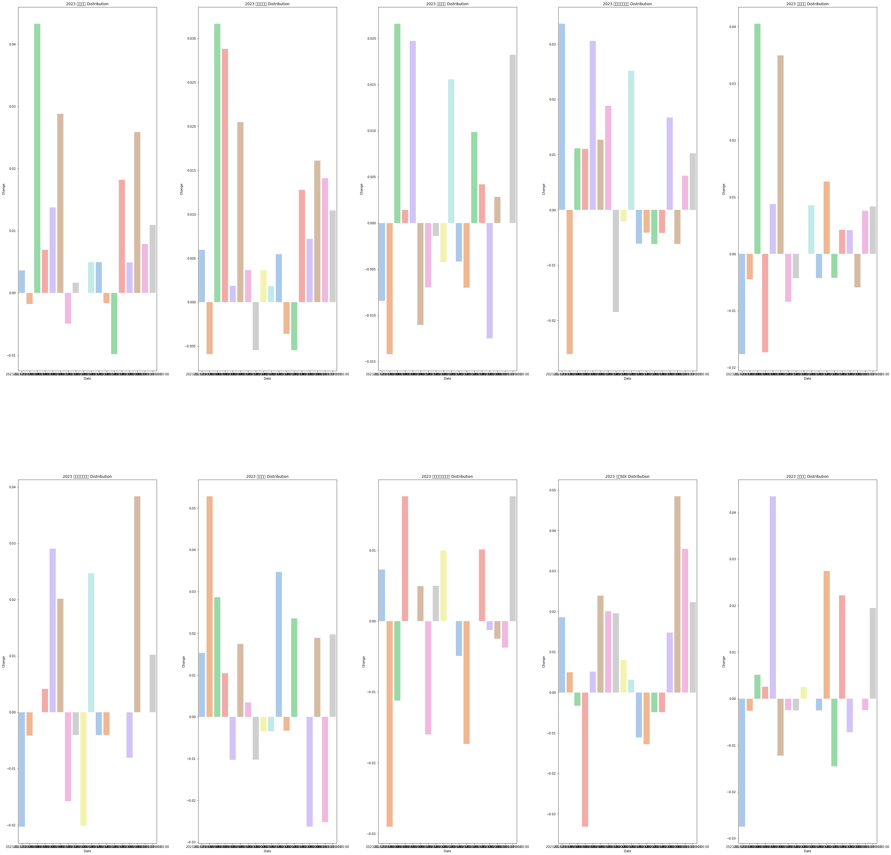

- 데이터 불러오기


```python
!pip install -U finance-datareader
```

    Looking in indexes: https://pypi.org/simple, https://us-python.pkg.dev/colab-wheels/public/simple/
    Collecting finance-datareader
      Downloading finance_datareader-0.9.50-py3-none-any.whl (19 kB)
    Requirement already satisfied: requests>=2.3.0 in /usr/local/lib/python3.8/dist-packages (from finance-datareader) (2.25.1)
    Requirement already satisfied: pandas>=0.19.2 in /usr/local/lib/python3.8/dist-packages (from finance-datareader) (1.3.5)
    Requirement already satisfied: tqdm in /usr/local/lib/python3.8/dist-packages (from finance-datareader) (4.64.1)
    Requirement already satisfied: lxml in /usr/local/lib/python3.8/dist-packages (from finance-datareader) (4.9.2)
    Collecting requests-file
      Downloading requests_file-1.5.1-py2.py3-none-any.whl (3.7 kB)
    Requirement already satisfied: python-dateutil>=2.7.3 in /usr/local/lib/python3.8/dist-packages (from pandas>=0.19.2->finance-datareader) (2.8.2)
    Requirement already satisfied: numpy>=1.17.3 in /usr/local/lib/python3.8/dist-packages (from pandas>=0.19.2->finance-datareader) (1.21.6)
    Requirement already satisfied: pytz>=2017.3 in /usr/local/lib/python3.8/dist-packages (from pandas>=0.19.2->finance-datareader) (2022.7)
    Requirement already satisfied: chardet<5,>=3.0.2 in /usr/local/lib/python3.8/dist-packages (from requests>=2.3.0->finance-datareader) (4.0.0)
    Requirement already satisfied: idna<3,>=2.5 in /usr/local/lib/python3.8/dist-packages (from requests>=2.3.0->finance-datareader) (2.10)
    Requirement already satisfied: certifi>=2017.4.17 in /usr/local/lib/python3.8/dist-packages (from requests>=2.3.0->finance-datareader) (2022.12.7)
    Requirement already satisfied: urllib3<1.27,>=1.21.1 in /usr/local/lib/python3.8/dist-packages (from requests>=2.3.0->finance-datareader) (1.24.3)
    Requirement already satisfied: six in /usr/local/lib/python3.8/dist-packages (from requests-file->finance-datareader) (1.15.0)
    Installing collected packages: requests-file, finance-datareader
    Successfully installed finance-datareader-0.9.50 requests-file-1.5.1


```python
import FinanceDataReader as fdr
```


```python
df_krx=fdr.StockListing('krx')
df_krx
```


  <div id="df-df355e9d-2061-4bb1-a553-112e4a52c627">
    <div class="colab-df-container">
      <div>
<style scoped>
    .dataframe tbody tr th:only-of-type {
        vertical-align: middle;
    }

    .dataframe tbody tr th {
        vertical-align: top;
    }

    .dataframe thead th {
        text-align: right;
    }
</style>
<table border="1" class="dataframe">
  <thead>
    <tr style="text-align: right;">
      <th></th>
      <th>Code</th>
      <th>ISU_CD</th>
      <th>Name</th>
      <th>Market</th>
      <th>Dept</th>
      <th>Close</th>
      <th>ChangeCode</th>
      <th>Changes</th>
      <th>ChagesRatio</th>
      <th>Open</th>
      <th>High</th>
      <th>Low</th>
      <th>Volume</th>
      <th>Amount</th>
      <th>Marcap</th>
      <th>Stocks</th>
      <th>MarketId</th>
    </tr>
  </thead>
  <tbody>
    <tr>
      <th>0</th>
      <td>005930</td>
      <td>KR7005930003</td>
      <td>삼성전자</td>
      <td>KOSPI</td>
      <td></td>
      <td>64600</td>
      <td>1</td>
      <td>700</td>
      <td>1.10</td>
      <td>64400</td>
      <td>65000</td>
      <td>63900</td>
      <td>18760182</td>
      <td>1212764792491</td>
      <td>385647952730000</td>
      <td>5969782550</td>
      <td>STK</td>
    </tr>
    <tr>
      <th>1</th>
      <td>373220</td>
      <td>KR7373220003</td>
      <td>LG에너지솔루션</td>
      <td>KOSPI</td>
      <td></td>
      <td>506000</td>
      <td>2</td>
      <td>-11000</td>
      <td>-2.13</td>
      <td>525000</td>
      <td>526000</td>
      <td>504000</td>
      <td>459245</td>
      <td>235054829000</td>
      <td>118404000000000</td>
      <td>234000000</td>
      <td>STK</td>
    </tr>
    <tr>
      <th>2</th>
      <td>000660</td>
      <td>KR7000660001</td>
      <td>SK하이닉스</td>
      <td>KOSPI</td>
      <td></td>
      <td>91500</td>
      <td>2</td>
      <td>-800</td>
      <td>-0.87</td>
      <td>91300</td>
      <td>92800</td>
      <td>90300</td>
      <td>2553811</td>
      <td>234318676392</td>
      <td>66612216397500</td>
      <td>728002365</td>
      <td>STK</td>
    </tr>
    <tr>
      <th>3</th>
      <td>207940</td>
      <td>KR7207940008</td>
      <td>삼성바이오로직스</td>
      <td>KOSPI</td>
      <td></td>
      <td>809000</td>
      <td>1</td>
      <td>14000</td>
      <td>1.76</td>
      <td>794000</td>
      <td>811000</td>
      <td>791000</td>
      <td>83364</td>
      <td>67041865000</td>
      <td>57579766000000</td>
      <td>71174000</td>
      <td>STK</td>
    </tr>
    <tr>
      <th>4</th>
      <td>051910</td>
      <td>KR7051910008</td>
      <td>LG화학</td>
      <td>KOSPI</td>
      <td></td>
      <td>685000</td>
      <td>3</td>
      <td>0</td>
      <td>0.00</td>
      <td>696000</td>
      <td>696000</td>
      <td>674000</td>
      <td>186406</td>
      <td>127932320000</td>
      <td>48355754955000</td>
      <td>70592343</td>
      <td>STK</td>
    </tr>
    <tr>
      <th>...</th>
      <td>...</td>
      <td>...</td>
      <td>...</td>
      <td>...</td>
      <td>...</td>
      <td>...</td>
      <td>...</td>
      <td>...</td>
      <td>...</td>
      <td>...</td>
      <td>...</td>
      <td>...</td>
      <td>...</td>
      <td>...</td>
      <td>...</td>
      <td>...</td>
      <td>...</td>
    </tr>
    <tr>
      <th>2689</th>
      <td>308700</td>
      <td>KR7308700004</td>
      <td>테크엔</td>
      <td>KONEX</td>
      <td>일반기업부</td>
      <td>577</td>
      <td>1</td>
      <td>18</td>
      <td>3.22</td>
      <td>577</td>
      <td>577</td>
      <td>577</td>
      <td>1</td>
      <td>577</td>
      <td>2308000000</td>
      <td>4000000</td>
      <td>KNX</td>
    </tr>
    <tr>
      <th>2690</th>
      <td>215050</td>
      <td>KR7215050006</td>
      <td>비엔디생활건강</td>
      <td>KONEX</td>
      <td>일반기업부</td>
      <td>912</td>
      <td>0</td>
      <td>0</td>
      <td>0.00</td>
      <td>0</td>
      <td>0</td>
      <td>0</td>
      <td>0</td>
      <td>0</td>
      <td>1934959392</td>
      <td>2121666</td>
      <td>KNX</td>
    </tr>
    <tr>
      <th>2691</th>
      <td>267810</td>
      <td>KR7267810000</td>
      <td>앙츠</td>
      <td>KONEX</td>
      <td>일반기업부</td>
      <td>1058</td>
      <td>4</td>
      <td>138</td>
      <td>15.00</td>
      <td>1058</td>
      <td>1058</td>
      <td>1058</td>
      <td>5</td>
      <td>5290</td>
      <td>1890646000</td>
      <td>1787000</td>
      <td>KNX</td>
    </tr>
    <tr>
      <th>2692</th>
      <td>267060</td>
      <td>KR7267060002</td>
      <td>명진홀딩스</td>
      <td>KONEX</td>
      <td>일반기업부</td>
      <td>181</td>
      <td>0</td>
      <td>0</td>
      <td>0.00</td>
      <td>0</td>
      <td>0</td>
      <td>0</td>
      <td>0</td>
      <td>0</td>
      <td>1654666524</td>
      <td>9141804</td>
      <td>KNX</td>
    </tr>
    <tr>
      <th>2693</th>
      <td>322190</td>
      <td>KR7322190000</td>
      <td>베른</td>
      <td>KONEX</td>
      <td>일반기업부</td>
      <td>108</td>
      <td>1</td>
      <td>3</td>
      <td>2.86</td>
      <td>117</td>
      <td>120</td>
      <td>104</td>
      <td>15841</td>
      <td>1767850</td>
      <td>963921276</td>
      <td>8925197</td>
      <td>KNX</td>
    </tr>
  </tbody>
</table>
<p>2694 rows × 17 columns</p>
</div>
      <button class="colab-df-convert" onclick="convertToInteractive('df-df355e9d-2061-4bb1-a553-112e4a52c627')"
              title="Convert this dataframe to an interactive table."
              style="display:none;">

  <svg xmlns="http://www.w3.org/2000/svg" height="24px"viewBox="0 0 24 24"
       width="24px">
    <path d="M0 0h24v24H0V0z" fill="none"/>
    <path d="M18.56 5.44l.94 2.06.94-2.06 2.06-.94-2.06-.94-.94-2.06-.94 2.06-2.06.94zm-11 1L8.5 8.5l.94-2.06 2.06-.94-2.06-.94L8.5 2.5l-.94 2.06-2.06.94zm10 10l.94 2.06.94-2.06 2.06-.94-2.06-.94-.94-2.06-.94 2.06-2.06.94z"/><path d="M17.41 7.96l-1.37-1.37c-.4-.4-.92-.59-1.43-.59-.52 0-1.04.2-1.43.59L10.3 9.45l-7.72 7.72c-.78.78-.78 2.05 0 2.83L4 21.41c.39.39.9.59 1.41.59.51 0 1.02-.2 1.41-.59l7.78-7.78 2.81-2.81c.8-.78.8-2.07 0-2.86zM5.41 20L4 18.59l7.72-7.72 1.47 1.35L5.41 20z"/>
  </svg>
      </button>

  <style>
    .colab-df-container {
      display:flex;
      flex-wrap:wrap;
      gap: 12px;
    }

    .colab-df-convert {
      background-color: #E8F0FE;
      border: none;
      border-radius: 50%;
      cursor: pointer;
      display: none;
      fill: #1967D2;
      height: 32px;
      padding: 0 0 0 0;
      width: 32px;
    }

    .colab-df-convert:hover {
      background-color: #E2EBFA;
      box-shadow: 0px 1px 2px rgba(60, 64, 67, 0.3), 0px 1px 3px 1px rgba(60, 64, 67, 0.15);
      fill: #174EA6;
    }

    [theme=dark] .colab-df-convert {
      background-color: #3B4455;
      fill: #D2E3FC;
    }

    [theme=dark] .colab-df-convert:hover {
      background-color: #434B5C;
      box-shadow: 0px 1px 3px 1px rgba(0, 0, 0, 0.15);
      filter: drop-shadow(0px 1px 2px rgba(0, 0, 0, 0.3));
      fill: #FFFFFF;
    }
  </style>

      <script>
        const buttonEl =
          document.querySelector('#df-df355e9d-2061-4bb1-a553-112e4a52c627 button.colab-df-convert');
        buttonEl.style.display =
          google.colab.kernel.accessAllowed ? 'block' : 'none';

        async function convertToInteractive(key) {
          const element = document.querySelector('#df-df355e9d-2061-4bb1-a553-112e4a52c627');
          const dataTable =
            await google.colab.kernel.invokeFunction('convertToInteractive',
                                                     [key], {});
          if (!dataTable) return;

          const docLinkHtml = 'Like what you see? Visit the ' +
            '<a target="_blank" href=https://colab.research.google.com/notebooks/data_table.ipynb>data table notebook</a>'
            + ' to learn more about interactive tables.';
          element.innerHTML = '';
          dataTable['output_type'] = 'display_data';
          await google.colab.output.renderOutput(dataTable, element);
          const docLink = document.createElement('div');
          docLink.innerHTML = docLinkHtml;
          element.appendChild(docLink);
        }
      </script>
    </div>
  </div>


```python
df_krx['Name'].unique()
```


```python
    array(['삼성전자', 'LG에너지솔루션', 'SK하이닉스', ..., '앙츠', '명진홀딩스', '베른'],
          dtype=object)
```


```python
df_krx.columns
```


```python
    Index(['Code', 'ISU_CD', 'Name', 'Market', 'Dept', 'Close', 'ChangeCode',
           'Changes', 'ChagesRatio', 'Open', 'High', 'Low', 'Volume', 'Amount',
           'Marcap', 'Stocks', 'MarketId'],
          dtype='object')
```


# 삼성 상위 10개 기업의 stocks 지수 변화 그래프


```python
import pandas as pd
data=pd.DataFrame({'Code':[],'Name':[],'Market':[],'Amount':[],'Stocks':[]})
j=0
for i in df_krx['Name'].unique():
  if '삼성' in i :
    data=pd.concat([data,df_krx[df_krx['Name']==i][['Code','Name','Market','Amount','Stocks']]],ignore_index=True)
    j+=1
data=data[:10]
data=data.sort_values(by='Stocks',ascending=False,ignore_index=True)
data.sort_values(by='Stocks',ascending=False,ignore_index=True)
```


  <div id="df-362f202a-5ac5-45bf-951d-4d9e3f1767a7">
    <div class="colab-df-container">
      <div>
<style scoped>
    .dataframe tbody tr th:only-of-type {
        vertical-align: middle;
    }

    .dataframe tbody tr th {
        vertical-align: top;
    }

    .dataframe thead th {
        text-align: right;
    }
</style>
<table border="1" class="dataframe">
  <thead>
    <tr style="text-align: right;">
      <th></th>
      <th>Code</th>
      <th>Name</th>
      <th>Market</th>
      <th>Amount</th>
      <th>Stocks</th>
    </tr>
  </thead>
  <tbody>
    <tr>
      <th>0</th>
      <td>005930</td>
      <td>삼성전자</td>
      <td>KOSPI</td>
      <td>1.212765e+12</td>
      <td>5.969783e+09</td>
    </tr>
    <tr>
      <th>1</th>
      <td>005935</td>
      <td>삼성전자우</td>
      <td>KOSPI</td>
      <td>7.552297e+10</td>
      <td>8.228867e+08</td>
    </tr>
    <tr>
      <th>2</th>
      <td>032830</td>
      <td>삼성생명</td>
      <td>KOSPI</td>
      <td>1.982899e+10</td>
      <td>2.000000e+08</td>
    </tr>
    <tr>
      <th>3</th>
      <td>028050</td>
      <td>삼성엔지니어링</td>
      <td>KOSPI</td>
      <td>2.453809e+10</td>
      <td>1.960000e+08</td>
    </tr>
    <tr>
      <th>4</th>
      <td>028260</td>
      <td>삼성물산</td>
      <td>KOSPI</td>
      <td>3.364601e+10</td>
      <td>1.868871e+08</td>
    </tr>
    <tr>
      <th>5</th>
      <td>018260</td>
      <td>삼성에스디에스</td>
      <td>KOSPI</td>
      <td>1.668860e+10</td>
      <td>7.737780e+07</td>
    </tr>
    <tr>
      <th>6</th>
      <td>009150</td>
      <td>삼성전기</td>
      <td>KOSPI</td>
      <td>7.336925e+10</td>
      <td>7.469370e+07</td>
    </tr>
    <tr>
      <th>7</th>
      <td>207940</td>
      <td>삼성바이오로직스</td>
      <td>KOSPI</td>
      <td>6.704186e+10</td>
      <td>7.117400e+07</td>
    </tr>
    <tr>
      <th>8</th>
      <td>006400</td>
      <td>삼성SDI</td>
      <td>KOSPI</td>
      <td>1.805389e+11</td>
      <td>6.876453e+07</td>
    </tr>
    <tr>
      <th>9</th>
      <td>000810</td>
      <td>삼성화재</td>
      <td>KOSPI</td>
      <td>1.409532e+10</td>
      <td>4.737484e+07</td>
    </tr>
  </tbody>
</table>
</div>
      <button class="colab-df-convert" onclick="convertToInteractive('df-362f202a-5ac5-45bf-951d-4d9e3f1767a7')"
              title="Convert this dataframe to an interactive table."
              style="display:none;">

  <svg xmlns="http://www.w3.org/2000/svg" height="24px"viewBox="0 0 24 24"
       width="24px">
    <path d="M0 0h24v24H0V0z" fill="none"/>
    <path d="M18.56 5.44l.94 2.06.94-2.06 2.06-.94-2.06-.94-.94-2.06-.94 2.06-2.06.94zm-11 1L8.5 8.5l.94-2.06 2.06-.94-2.06-.94L8.5 2.5l-.94 2.06-2.06.94zm10 10l.94 2.06.94-2.06 2.06-.94-2.06-.94-.94-2.06-.94 2.06-2.06.94z"/><path d="M17.41 7.96l-1.37-1.37c-.4-.4-.92-.59-1.43-.59-.52 0-1.04.2-1.43.59L10.3 9.45l-7.72 7.72c-.78.78-.78 2.05 0 2.83L4 21.41c.39.39.9.59 1.41.59.51 0 1.02-.2 1.41-.59l7.78-7.78 2.81-2.81c.8-.78.8-2.07 0-2.86zM5.41 20L4 18.59l7.72-7.72 1.47 1.35L5.41 20z"/>
  </svg>
      </button>

  <style>
    .colab-df-container {
      display:flex;
      flex-wrap:wrap;
      gap: 12px;
    }

    .colab-df-convert {
      background-color: #E8F0FE;
      border: none;
      border-radius: 50%;
      cursor: pointer;
      display: none;
      fill: #1967D2;
      height: 32px;
      padding: 0 0 0 0;
      width: 32px;
    }

    .colab-df-convert:hover {
      background-color: #E2EBFA;
      box-shadow: 0px 1px 2px rgba(60, 64, 67, 0.3), 0px 1px 3px 1px rgba(60, 64, 67, 0.15);
      fill: #174EA6;
    }

    [theme=dark] .colab-df-convert {
      background-color: #3B4455;
      fill: #D2E3FC;
    }

    [theme=dark] .colab-df-convert:hover {
      background-color: #434B5C;
      box-shadow: 0px 1px 3px 1px rgba(0, 0, 0, 0.15);
      filter: drop-shadow(0px 1px 2px rgba(0, 0, 0, 0.3));
      fill: #FFFFFF;
    }
  </style>

      <script>
        const buttonEl =
          document.querySelector('#df-362f202a-5ac5-45bf-951d-4d9e3f1767a7 button.colab-df-convert');
        buttonEl.style.display =
          google.colab.kernel.accessAllowed ? 'block' : 'none';

        async function convertToInteractive(key) {
          const element = document.querySelector('#df-362f202a-5ac5-45bf-951d-4d9e3f1767a7');
          const dataTable =
            await google.colab.kernel.invokeFunction('convertToInteractive',
                                                     [key], {});
          if (!dataTable) return;

          const docLinkHtml = 'Like what you see? Visit the ' +
            '<a target="_blank" href=https://colab.research.google.com/notebooks/data_table.ipynb>data table notebook</a>'
            + ' to learn more about interactive tables.';
          element.innerHTML = '';
          dataTable['output_type'] = 'display_data';
          await google.colab.output.renderOutput(dataTable, element);
          const docLink = document.createElement('div');
          docLink.innerHTML = docLinkHtml;
          element.appendChild(docLink);
        }
      </script>
    </div>
  </div>


```python
dic=dict()
i=0
for i in data['Name'].unique():
  if '삼성' in i :
    for x,y in enumerate(df_krx[df_krx['Name']==i]['Code']):
      dic[i]=y
print(dic)
```
```python
    {'삼성전자': '005930', '삼성전자우': '005935', '삼성생명': '032830', '삼성엔지니어링': '028050', '삼성물산': '028260', '삼성에스디에스': '018260', '삼성전기': '009150', '삼성바이오로직스': '207940', '삼성SDI': '006400', '삼성화재': '000810'}
```


```python
data[['Name','Code']]
```


  <div id="df-a1127b3f-3e25-4b65-ad81-acd23132aaef">
    <div class="colab-df-container">
      <div>
<style scoped>
    .dataframe tbody tr th:only-of-type {
        vertical-align: middle;
    }

    .dataframe tbody tr th {
        vertical-align: top;
    }

    .dataframe thead th {
        text-align: right;
    }
</style>
<table border="1" class="dataframe">
  <thead>
    <tr style="text-align: right;">
      <th></th>
      <th>Name</th>
      <th>Code</th>
    </tr>
  </thead>
  <tbody>
    <tr>
      <th>0</th>
      <td>삼성전자</td>
      <td>005930</td>
    </tr>
    <tr>
      <th>1</th>
      <td>삼성전자우</td>
      <td>005935</td>
    </tr>
    <tr>
      <th>2</th>
      <td>삼성생명</td>
      <td>032830</td>
    </tr>
    <tr>
      <th>3</th>
      <td>삼성엔지니어링</td>
      <td>028050</td>
    </tr>
    <tr>
      <th>4</th>
      <td>삼성물산</td>
      <td>028260</td>
    </tr>
    <tr>
      <th>5</th>
      <td>삼성에스디에스</td>
      <td>018260</td>
    </tr>
    <tr>
      <th>6</th>
      <td>삼성전기</td>
      <td>009150</td>
    </tr>
    <tr>
      <th>7</th>
      <td>삼성바이오로직스</td>
      <td>207940</td>
    </tr>
    <tr>
      <th>8</th>
      <td>삼성SDI</td>
      <td>006400</td>
    </tr>
    <tr>
      <th>9</th>
      <td>삼성화재</td>
      <td>000810</td>
    </tr>
  </tbody>
</table>
</div>
      <button class="colab-df-convert" onclick="convertToInteractive('df-a1127b3f-3e25-4b65-ad81-acd23132aaef')"
              title="Convert this dataframe to an interactive table."
              style="display:none;">

  <svg xmlns="http://www.w3.org/2000/svg" height="24px"viewBox="0 0 24 24"
       width="24px">
    <path d="M0 0h24v24H0V0z" fill="none"/>
    <path d="M18.56 5.44l.94 2.06.94-2.06 2.06-.94-2.06-.94-.94-2.06-.94 2.06-2.06.94zm-11 1L8.5 8.5l.94-2.06 2.06-.94-2.06-.94L8.5 2.5l-.94 2.06-2.06.94zm10 10l.94 2.06.94-2.06 2.06-.94-2.06-.94-.94-2.06-.94 2.06-2.06.94z"/><path d="M17.41 7.96l-1.37-1.37c-.4-.4-.92-.59-1.43-.59-.52 0-1.04.2-1.43.59L10.3 9.45l-7.72 7.72c-.78.78-.78 2.05 0 2.83L4 21.41c.39.39.9.59 1.41.59.51 0 1.02-.2 1.41-.59l7.78-7.78 2.81-2.81c.8-.78.8-2.07 0-2.86zM5.41 20L4 18.59l7.72-7.72 1.47 1.35L5.41 20z"/>
  </svg>
      </button>

  <style>
    .colab-df-container {
      display:flex;
      flex-wrap:wrap;
      gap: 12px;
    }

    .colab-df-convert {
      background-color: #E8F0FE;
      border: none;
      border-radius: 50%;
      cursor: pointer;
      display: none;
      fill: #1967D2;
      height: 32px;
      padding: 0 0 0 0;
      width: 32px;
    }

    .colab-df-convert:hover {
      background-color: #E2EBFA;
      box-shadow: 0px 1px 2px rgba(60, 64, 67, 0.3), 0px 1px 3px 1px rgba(60, 64, 67, 0.15);
      fill: #174EA6;
    }

    [theme=dark] .colab-df-convert {
      background-color: #3B4455;
      fill: #D2E3FC;
    }

    [theme=dark] .colab-df-convert:hover {
      background-color: #434B5C;
      box-shadow: 0px 1px 3px 1px rgba(0, 0, 0, 0.15);
      filter: drop-shadow(0px 1px 2px rgba(0, 0, 0, 0.3));
      fill: #FFFFFF;
    }
  </style>

      <script>
        const buttonEl =
          document.querySelector('#df-a1127b3f-3e25-4b65-ad81-acd23132aaef button.colab-df-convert');
        buttonEl.style.display =
          google.colab.kernel.accessAllowed ? 'block' : 'none';

        async function convertToInteractive(key) {
          const element = document.querySelector('#df-a1127b3f-3e25-4b65-ad81-acd23132aaef');
          const dataTable =
            await google.colab.kernel.invokeFunction('convertToInteractive',
                                                     [key], {});
          if (!dataTable) return;

          const docLinkHtml = 'Like what you see? Visit the ' +
            '<a target="_blank" href=https://colab.research.google.com/notebooks/data_table.ipynb>data table notebook</a>'
            + ' to learn more about interactive tables.';
          element.innerHTML = '';
          dataTable['output_type'] = 'display_data';
          await google.colab.output.renderOutput(dataTable, element);
          const docLink = document.createElement('div');
          docLink.innerHTML = docLinkHtml;
          element.appendChild(docLink);
        }
      </script>
    </div>
  </div>


```python
import matplotlib.pyplot as plt
import seaborn as sns
import matplotlib.gridspec as gridspec
grid=gridspec.GridSpec(2,5)#그래프를 그릴 도화지 개수 
plt.figure(figsize=(50,50))
plt.subplots_adjust(wspace=0.3,hspace=0.3) #그래프 간의 거리 조절

#서버플롯 그리기
for idx, feature in enumerate(dic.keys()):
  data=fdr.DataReader(dic[feature],'2023')
  ax=plt.subplot(grid[idx])
  sns.barplot(x=data.index,y='Change',data=data,palette='pastel',ax=ax)
  ax.set_title(f'2023 {feature} Distribution')
```


    


> 삼성은 상승과 하락의 비율이 비슷하다.


```python

```

#  LG 상위 10개 기업의 stocks 지수 변화 그래프


```python
import pandas as pd
data=pd.DataFrame({'Code':[],'Name':[],'Market':[],'Amount':[],'Stocks':[]})
j=0
for i in df_krx['Name'].unique():
  if 'LG' in i :
    data=pd.concat([data,df_krx[df_krx['Name']==i][['Code','Name','Market','Amount','Stocks']]],ignore_index=True)
    j+=1
data=data[:10]
data=data.sort_values(by='Stocks',ascending=False,ignore_index=True)
data.sort_values(by='Stocks',ascending=False,ignore_index=True)
```


  <div id="df-8f263c05-2cd5-430c-b811-66d4f4c804a6">
    <div class="colab-df-container">
      <div>
<style scoped>
    .dataframe tbody tr th:only-of-type {
        vertical-align: middle;
    }

    .dataframe tbody tr th {
        vertical-align: top;
    }

    .dataframe thead th {
        text-align: right;
    }
</style>
<table border="1" class="dataframe">
  <thead>
    <tr style="text-align: right;">
      <th></th>
      <th>Code</th>
      <th>Name</th>
      <th>Market</th>
      <th>Amount</th>
      <th>Stocks</th>
    </tr>
  </thead>
  <tbody>
    <tr>
      <th>0</th>
      <td>032640</td>
      <td>LG유플러스</td>
      <td>KOSPI</td>
      <td>1.024826e+10</td>
      <td>436611361.0</td>
    </tr>
    <tr>
      <th>1</th>
      <td>034220</td>
      <td>LG디스플레이</td>
      <td>KOSPI</td>
      <td>4.074276e+10</td>
      <td>357815700.0</td>
    </tr>
    <tr>
      <th>2</th>
      <td>373220</td>
      <td>LG에너지솔루션</td>
      <td>KOSPI</td>
      <td>2.350548e+11</td>
      <td>234000000.0</td>
    </tr>
    <tr>
      <th>3</th>
      <td>066570</td>
      <td>LG전자</td>
      <td>KOSPI</td>
      <td>8.055368e+10</td>
      <td>163647814.0</td>
    </tr>
    <tr>
      <th>4</th>
      <td>003550</td>
      <td>LG</td>
      <td>KOSPI</td>
      <td>1.371246e+10</td>
      <td>157300993.0</td>
    </tr>
    <tr>
      <th>5</th>
      <td>051910</td>
      <td>LG화학</td>
      <td>KOSPI</td>
      <td>1.279323e+11</td>
      <td>70592343.0</td>
    </tr>
    <tr>
      <th>6</th>
      <td>011070</td>
      <td>LG이노텍</td>
      <td>KOSPI</td>
      <td>6.999296e+10</td>
      <td>23667107.0</td>
    </tr>
    <tr>
      <th>7</th>
      <td>066575</td>
      <td>LG전자우</td>
      <td>KOSPI</td>
      <td>1.688397e+09</td>
      <td>17185992.0</td>
    </tr>
    <tr>
      <th>8</th>
      <td>051900</td>
      <td>LG생활건강</td>
      <td>KOSPI</td>
      <td>7.692310e+10</td>
      <td>15618197.0</td>
    </tr>
    <tr>
      <th>9</th>
      <td>051915</td>
      <td>LG화학우</td>
      <td>KOSPI</td>
      <td>3.467882e+09</td>
      <td>7688800.0</td>
    </tr>
  </tbody>
</table>
</div>
      <button class="colab-df-convert" onclick="convertToInteractive('df-8f263c05-2cd5-430c-b811-66d4f4c804a6')"
              title="Convert this dataframe to an interactive table."
              style="display:none;">

  <svg xmlns="http://www.w3.org/2000/svg" height="24px"viewBox="0 0 24 24"
       width="24px">
    <path d="M0 0h24v24H0V0z" fill="none"/>
    <path d="M18.56 5.44l.94 2.06.94-2.06 2.06-.94-2.06-.94-.94-2.06-.94 2.06-2.06.94zm-11 1L8.5 8.5l.94-2.06 2.06-.94-2.06-.94L8.5 2.5l-.94 2.06-2.06.94zm10 10l.94 2.06.94-2.06 2.06-.94-2.06-.94-.94-2.06-.94 2.06-2.06.94z"/><path d="M17.41 7.96l-1.37-1.37c-.4-.4-.92-.59-1.43-.59-.52 0-1.04.2-1.43.59L10.3 9.45l-7.72 7.72c-.78.78-.78 2.05 0 2.83L4 21.41c.39.39.9.59 1.41.59.51 0 1.02-.2 1.41-.59l7.78-7.78 2.81-2.81c.8-.78.8-2.07 0-2.86zM5.41 20L4 18.59l7.72-7.72 1.47 1.35L5.41 20z"/>
  </svg>
      </button>

  <style>
    .colab-df-container {
      display:flex;
      flex-wrap:wrap;
      gap: 12px;
    }

    .colab-df-convert {
      background-color: #E8F0FE;
      border: none;
      border-radius: 50%;
      cursor: pointer;
      display: none;
      fill: #1967D2;
      height: 32px;
      padding: 0 0 0 0;
      width: 32px;
    }

    .colab-df-convert:hover {
      background-color: #E2EBFA;
      box-shadow: 0px 1px 2px rgba(60, 64, 67, 0.3), 0px 1px 3px 1px rgba(60, 64, 67, 0.15);
      fill: #174EA6;
    }

    [theme=dark] .colab-df-convert {
      background-color: #3B4455;
      fill: #D2E3FC;
    }

    [theme=dark] .colab-df-convert:hover {
      background-color: #434B5C;
      box-shadow: 0px 1px 3px 1px rgba(0, 0, 0, 0.15);
      filter: drop-shadow(0px 1px 2px rgba(0, 0, 0, 0.3));
      fill: #FFFFFF;
    }
  </style>

      <script>
        const buttonEl =
          document.querySelector('#df-8f263c05-2cd5-430c-b811-66d4f4c804a6 button.colab-df-convert');
        buttonEl.style.display =
          google.colab.kernel.accessAllowed ? 'block' : 'none';

        async function convertToInteractive(key) {
          const element = document.querySelector('#df-8f263c05-2cd5-430c-b811-66d4f4c804a6');
          const dataTable =
            await google.colab.kernel.invokeFunction('convertToInteractive',
                                                     [key], {});
          if (!dataTable) return;

          const docLinkHtml = 'Like what you see? Visit the ' +
            '<a target="_blank" href=https://colab.research.google.com/notebooks/data_table.ipynb>data table notebook</a>'
            + ' to learn more about interactive tables.';
          element.innerHTML = '';
          dataTable['output_type'] = 'display_data';
          await google.colab.output.renderOutput(dataTable, element);
          const docLink = document.createElement('div');
          docLink.innerHTML = docLinkHtml;
          element.appendChild(docLink);
        }
      </script>
    </div>
  </div>


```python
dic=dict()
i=0
for i in data['Name'].unique():
  if 'LG' in i :
    for x,y in enumerate(data[data['Name']==i]['Code']):
      dic[i]=y
print(dic)
```
```python
    {'LG유플러스': '032640', 'LG디스플레이': '034220', 'LG에너지솔루션': '373220', 'LG전자': '066570', 'LG': '003550', 'LG화학': '051910', 'LG이노텍': '011070', 'LG전자우': '066575', 'LG생활건강': '051900', 'LG화학우': '051915'}
```


```python
data[['Name','Code']]
```


  <div id="df-2447d314-63d3-49b6-9fdd-b399dc3610d2">
    <div class="colab-df-container">
      <div>
<style scoped>
    .dataframe tbody tr th:only-of-type {
        vertical-align: middle;
    }

    .dataframe tbody tr th {
        vertical-align: top;
    }

    .dataframe thead th {
        text-align: right;
    }
</style>
<table border="1" class="dataframe">
  <thead>
    <tr style="text-align: right;">
      <th></th>
      <th>Name</th>
      <th>Code</th>
    </tr>
  </thead>
  <tbody>
    <tr>
      <th>0</th>
      <td>LG유플러스</td>
      <td>032640</td>
    </tr>
    <tr>
      <th>1</th>
      <td>LG디스플레이</td>
      <td>034220</td>
    </tr>
    <tr>
      <th>2</th>
      <td>LG에너지솔루션</td>
      <td>373220</td>
    </tr>
    <tr>
      <th>3</th>
      <td>LG전자</td>
      <td>066570</td>
    </tr>
    <tr>
      <th>4</th>
      <td>LG</td>
      <td>003550</td>
    </tr>
    <tr>
      <th>5</th>
      <td>LG화학</td>
      <td>051910</td>
    </tr>
    <tr>
      <th>6</th>
      <td>LG이노텍</td>
      <td>011070</td>
    </tr>
    <tr>
      <th>7</th>
      <td>LG전자우</td>
      <td>066575</td>
    </tr>
    <tr>
      <th>8</th>
      <td>LG생활건강</td>
      <td>051900</td>
    </tr>
    <tr>
      <th>9</th>
      <td>LG화학우</td>
      <td>051915</td>
    </tr>
  </tbody>
</table>
</div>
      <button class="colab-df-convert" onclick="convertToInteractive('df-2447d314-63d3-49b6-9fdd-b399dc3610d2')"
              title="Convert this dataframe to an interactive table."
              style="display:none;">

  <svg xmlns="http://www.w3.org/2000/svg" height="24px"viewBox="0 0 24 24"
       width="24px">
    <path d="M0 0h24v24H0V0z" fill="none"/>
    <path d="M18.56 5.44l.94 2.06.94-2.06 2.06-.94-2.06-.94-.94-2.06-.94 2.06-2.06.94zm-11 1L8.5 8.5l.94-2.06 2.06-.94-2.06-.94L8.5 2.5l-.94 2.06-2.06.94zm10 10l.94 2.06.94-2.06 2.06-.94-2.06-.94-.94-2.06-.94 2.06-2.06.94z"/><path d="M17.41 7.96l-1.37-1.37c-.4-.4-.92-.59-1.43-.59-.52 0-1.04.2-1.43.59L10.3 9.45l-7.72 7.72c-.78.78-.78 2.05 0 2.83L4 21.41c.39.39.9.59 1.41.59.51 0 1.02-.2 1.41-.59l7.78-7.78 2.81-2.81c.8-.78.8-2.07 0-2.86zM5.41 20L4 18.59l7.72-7.72 1.47 1.35L5.41 20z"/>
  </svg>
      </button>

  <style>
    .colab-df-container {
      display:flex;
      flex-wrap:wrap;
      gap: 12px;
    }

    .colab-df-convert {
      background-color: #E8F0FE;
      border: none;
      border-radius: 50%;
      cursor: pointer;
      display: none;
      fill: #1967D2;
      height: 32px;
      padding: 0 0 0 0;
      width: 32px;
    }

    .colab-df-convert:hover {
      background-color: #E2EBFA;
      box-shadow: 0px 1px 2px rgba(60, 64, 67, 0.3), 0px 1px 3px 1px rgba(60, 64, 67, 0.15);
      fill: #174EA6;
    }

    [theme=dark] .colab-df-convert {
      background-color: #3B4455;
      fill: #D2E3FC;
    }

    [theme=dark] .colab-df-convert:hover {
      background-color: #434B5C;
      box-shadow: 0px 1px 3px 1px rgba(0, 0, 0, 0.15);
      filter: drop-shadow(0px 1px 2px rgba(0, 0, 0, 0.3));
      fill: #FFFFFF;
    }
  </style>

      <script>
        const buttonEl =
          document.querySelector('#df-2447d314-63d3-49b6-9fdd-b399dc3610d2 button.colab-df-convert');
        buttonEl.style.display =
          google.colab.kernel.accessAllowed ? 'block' : 'none';

        async function convertToInteractive(key) {
          const element = document.querySelector('#df-2447d314-63d3-49b6-9fdd-b399dc3610d2');
          const dataTable =
            await google.colab.kernel.invokeFunction('convertToInteractive',
                                                     [key], {});
          if (!dataTable) return;

          const docLinkHtml = 'Like what you see? Visit the ' +
            '<a target="_blank" href=https://colab.research.google.com/notebooks/data_table.ipynb>data table notebook</a>'
            + ' to learn more about interactive tables.';
          element.innerHTML = '';
          dataTable['output_type'] = 'display_data';
          await google.colab.output.renderOutput(dataTable, element);
          const docLink = document.createElement('div');
          docLink.innerHTML = docLinkHtml;
          element.appendChild(docLink);
        }
      </script>
    </div>
  </div>


```python
import matplotlib.pyplot as plt
import seaborn as sns
import matplotlib.gridspec as gridspec
grid=gridspec.GridSpec(2,5)#그래프를 그릴 도화지 개수 
plt.figure(figsize=(50,50))
plt.subplots_adjust(wspace=0.3,hspace=0.3) #그래프 간의 거리 조절

#서버플롯 그리기
for idx, feature in enumerate(dic.keys()):
  data=fdr.DataReader(dic[feature],'2023')
  ax=plt.subplot(grid[idx])
  sns.barplot(x=data.index,y='Change',data=data,palette='pastel',ax=ax)
  ax.set_title(f'2023 {feature} Distribution')
```

 
    

    


> LG는 전체적으로 상승 비율이 높다.


```python

```

# SK 상위 10개 기업의 stocks 지수 변화 그래프


```python
import pandas as pd
data=pd.DataFrame({'Code':[],'Name':[],'Market':[],'Amount':[],'Stocks':[]})
j=0
for i in df_krx['Name'].unique():
  if 'SK' in i :
    data=pd.concat([data,df_krx[df_krx['Name']==i][['Code','Name','Market','Amount','Stocks']]],ignore_index=True)
    j+=1
data=data[:10]
data=data.sort_values(by='Stocks',ascending=False,ignore_index=True)
data.sort_values(by='Stocks',ascending=False,ignore_index=True)
```


  <div id="df-63bbcde6-eeb2-434f-9ee1-71bbacd74196">
    <div class="colab-df-container">
      <div>
<style scoped>
    .dataframe tbody tr th:only-of-type {
        vertical-align: middle;
    }

    .dataframe tbody tr th {
        vertical-align: top;
    }

    .dataframe thead th {
        text-align: right;
    }
</style>
<table border="1" class="dataframe">
  <thead>
    <tr style="text-align: right;">
      <th></th>
      <th>Code</th>
      <th>Name</th>
      <th>Market</th>
      <th>Amount</th>
      <th>Stocks</th>
    </tr>
  </thead>
  <tbody>
    <tr>
      <th>0</th>
      <td>000660</td>
      <td>SK하이닉스</td>
      <td>KOSPI</td>
      <td>2.343187e+11</td>
      <td>728002365.0</td>
    </tr>
    <tr>
      <th>1</th>
      <td>017670</td>
      <td>SK텔레콤</td>
      <td>KOSPI</td>
      <td>5.676284e+10</td>
      <td>218833144.0</td>
    </tr>
    <tr>
      <th>2</th>
      <td>402340</td>
      <td>SK스퀘어</td>
      <td>KOSPI</td>
      <td>2.073002e+10</td>
      <td>141467571.0</td>
    </tr>
    <tr>
      <th>3</th>
      <td>096770</td>
      <td>SK이노베이션</td>
      <td>KOSPI</td>
      <td>8.618066e+10</td>
      <td>92465564.0</td>
    </tr>
    <tr>
      <th>4</th>
      <td>326030</td>
      <td>SK바이오팜</td>
      <td>KOSPI</td>
      <td>6.950175e+09</td>
      <td>78313250.0</td>
    </tr>
    <tr>
      <th>5</th>
      <td>302440</td>
      <td>SK바이오사이언스</td>
      <td>KOSPI</td>
      <td>4.051631e+10</td>
      <td>76784046.0</td>
    </tr>
    <tr>
      <th>6</th>
      <td>034730</td>
      <td>SK</td>
      <td>KOSPI</td>
      <td>4.698633e+10</td>
      <td>74149329.0</td>
    </tr>
    <tr>
      <th>7</th>
      <td>361610</td>
      <td>SK아이이테크놀로지</td>
      <td>KOSPI</td>
      <td>4.402923e+10</td>
      <td>71297592.0</td>
    </tr>
    <tr>
      <th>8</th>
      <td>011790</td>
      <td>SKC</td>
      <td>KOSPI</td>
      <td>2.060931e+10</td>
      <td>37868298.0</td>
    </tr>
    <tr>
      <th>9</th>
      <td>285130</td>
      <td>SK케미칼</td>
      <td>KOSPI</td>
      <td>9.663268e+09</td>
      <td>17253783.0</td>
    </tr>
  </tbody>
</table>
</div>
      <button class="colab-df-convert" onclick="convertToInteractive('df-63bbcde6-eeb2-434f-9ee1-71bbacd74196')"
              title="Convert this dataframe to an interactive table."
              style="display:none;">

  <svg xmlns="http://www.w3.org/2000/svg" height="24px"viewBox="0 0 24 24"
       width="24px">
    <path d="M0 0h24v24H0V0z" fill="none"/>
    <path d="M18.56 5.44l.94 2.06.94-2.06 2.06-.94-2.06-.94-.94-2.06-.94 2.06-2.06.94zm-11 1L8.5 8.5l.94-2.06 2.06-.94-2.06-.94L8.5 2.5l-.94 2.06-2.06.94zm10 10l.94 2.06.94-2.06 2.06-.94-2.06-.94-.94-2.06-.94 2.06-2.06.94z"/><path d="M17.41 7.96l-1.37-1.37c-.4-.4-.92-.59-1.43-.59-.52 0-1.04.2-1.43.59L10.3 9.45l-7.72 7.72c-.78.78-.78 2.05 0 2.83L4 21.41c.39.39.9.59 1.41.59.51 0 1.02-.2 1.41-.59l7.78-7.78 2.81-2.81c.8-.78.8-2.07 0-2.86zM5.41 20L4 18.59l7.72-7.72 1.47 1.35L5.41 20z"/>
  </svg>
      </button>

  <style>
    .colab-df-container {
      display:flex;
      flex-wrap:wrap;
      gap: 12px;
    }

    .colab-df-convert {
      background-color: #E8F0FE;
      border: none;
      border-radius: 50%;
      cursor: pointer;
      display: none;
      fill: #1967D2;
      height: 32px;
      padding: 0 0 0 0;
      width: 32px;
    }

    .colab-df-convert:hover {
      background-color: #E2EBFA;
      box-shadow: 0px 1px 2px rgba(60, 64, 67, 0.3), 0px 1px 3px 1px rgba(60, 64, 67, 0.15);
      fill: #174EA6;
    }

    [theme=dark] .colab-df-convert {
      background-color: #3B4455;
      fill: #D2E3FC;
    }

    [theme=dark] .colab-df-convert:hover {
      background-color: #434B5C;
      box-shadow: 0px 1px 3px 1px rgba(0, 0, 0, 0.15);
      filter: drop-shadow(0px 1px 2px rgba(0, 0, 0, 0.3));
      fill: #FFFFFF;
    }
  </style>

      <script>
        const buttonEl =
          document.querySelector('#df-63bbcde6-eeb2-434f-9ee1-71bbacd74196 button.colab-df-convert');
        buttonEl.style.display =
          google.colab.kernel.accessAllowed ? 'block' : 'none';

        async function convertToInteractive(key) {
          const element = document.querySelector('#df-63bbcde6-eeb2-434f-9ee1-71bbacd74196');
          const dataTable =
            await google.colab.kernel.invokeFunction('convertToInteractive',
                                                     [key], {});
          if (!dataTable) return;

          const docLinkHtml = 'Like what you see? Visit the ' +
            '<a target="_blank" href=https://colab.research.google.com/notebooks/data_table.ipynb>data table notebook</a>'
            + ' to learn more about interactive tables.';
          element.innerHTML = '';
          dataTable['output_type'] = 'display_data';
          await google.colab.output.renderOutput(dataTable, element);
          const docLink = document.createElement('div');
          docLink.innerHTML = docLinkHtml;
          element.appendChild(docLink);
        }
      </script>
    </div>
  </div>


```python
dic=dict()
i=0
for i in data['Name'].unique():
  if 'SK' in i :
    for x,y in enumerate(data[data['Name']==i]['Code']):
      dic[i]=y
print(dic)
```
```python
    {'SK하이닉스': '000660', 'SK텔레콤': '017670', 'SK스퀘어': '402340', 'SK이노베이션': '096770', 'SK바이오팜': '326030', 'SK바이오사이언스': '302440', 'SK': '034730', 'SK아이이테크놀로지': '361610', 'SKC': '011790', 'SK케미칼': '285130'}
```


```python
data[['Name','Code']]
```


  <div id="df-35ec7178-c252-45fc-a2ac-53404d62bba6">
    <div class="colab-df-container">
      <div>
<style scoped>
    .dataframe tbody tr th:only-of-type {
        vertical-align: middle;
    }

    .dataframe tbody tr th {
        vertical-align: top;
    }

    .dataframe thead th {
        text-align: right;
    }
</style>
<table border="1" class="dataframe">
  <thead>
    <tr style="text-align: right;">
      <th></th>
      <th>Name</th>
      <th>Code</th>
    </tr>
  </thead>
  <tbody>
    <tr>
      <th>0</th>
      <td>SK하이닉스</td>
      <td>000660</td>
    </tr>
    <tr>
      <th>1</th>
      <td>SK텔레콤</td>
      <td>017670</td>
    </tr>
    <tr>
      <th>2</th>
      <td>SK스퀘어</td>
      <td>402340</td>
    </tr>
    <tr>
      <th>3</th>
      <td>SK이노베이션</td>
      <td>096770</td>
    </tr>
    <tr>
      <th>4</th>
      <td>SK바이오팜</td>
      <td>326030</td>
    </tr>
    <tr>
      <th>5</th>
      <td>SK바이오사이언스</td>
      <td>302440</td>
    </tr>
    <tr>
      <th>6</th>
      <td>SK</td>
      <td>034730</td>
    </tr>
    <tr>
      <th>7</th>
      <td>SK아이이테크놀로지</td>
      <td>361610</td>
    </tr>
    <tr>
      <th>8</th>
      <td>SKC</td>
      <td>011790</td>
    </tr>
    <tr>
      <th>9</th>
      <td>SK케미칼</td>
      <td>285130</td>
    </tr>
  </tbody>
</table>
</div>
      <button class="colab-df-convert" onclick="convertToInteractive('df-35ec7178-c252-45fc-a2ac-53404d62bba6')"
              title="Convert this dataframe to an interactive table."
              style="display:none;">

  <svg xmlns="http://www.w3.org/2000/svg" height="24px"viewBox="0 0 24 24"
       width="24px">
    <path d="M0 0h24v24H0V0z" fill="none"/>
    <path d="M18.56 5.44l.94 2.06.94-2.06 2.06-.94-2.06-.94-.94-2.06-.94 2.06-2.06.94zm-11 1L8.5 8.5l.94-2.06 2.06-.94-2.06-.94L8.5 2.5l-.94 2.06-2.06.94zm10 10l.94 2.06.94-2.06 2.06-.94-2.06-.94-.94-2.06-.94 2.06-2.06.94z"/><path d="M17.41 7.96l-1.37-1.37c-.4-.4-.92-.59-1.43-.59-.52 0-1.04.2-1.43.59L10.3 9.45l-7.72 7.72c-.78.78-.78 2.05 0 2.83L4 21.41c.39.39.9.59 1.41.59.51 0 1.02-.2 1.41-.59l7.78-7.78 2.81-2.81c.8-.78.8-2.07 0-2.86zM5.41 20L4 18.59l7.72-7.72 1.47 1.35L5.41 20z"/>
  </svg>
      </button>

  <style>
    .colab-df-container {
      display:flex;
      flex-wrap:wrap;
      gap: 12px;
    }

    .colab-df-convert {
      background-color: #E8F0FE;
      border: none;
      border-radius: 50%;
      cursor: pointer;
      display: none;
      fill: #1967D2;
      height: 32px;
      padding: 0 0 0 0;
      width: 32px;
    }

    .colab-df-convert:hover {
      background-color: #E2EBFA;
      box-shadow: 0px 1px 2px rgba(60, 64, 67, 0.3), 0px 1px 3px 1px rgba(60, 64, 67, 0.15);
      fill: #174EA6;
    }

    [theme=dark] .colab-df-convert {
      background-color: #3B4455;
      fill: #D2E3FC;
    }

    [theme=dark] .colab-df-convert:hover {
      background-color: #434B5C;
      box-shadow: 0px 1px 3px 1px rgba(0, 0, 0, 0.15);
      filter: drop-shadow(0px 1px 2px rgba(0, 0, 0, 0.3));
      fill: #FFFFFF;
    }
  </style>

      <script>
        const buttonEl =
          document.querySelector('#df-35ec7178-c252-45fc-a2ac-53404d62bba6 button.colab-df-convert');
        buttonEl.style.display =
          google.colab.kernel.accessAllowed ? 'block' : 'none';

        async function convertToInteractive(key) {
          const element = document.querySelector('#df-35ec7178-c252-45fc-a2ac-53404d62bba6');
          const dataTable =
            await google.colab.kernel.invokeFunction('convertToInteractive',
                                                     [key], {});
          if (!dataTable) return;

          const docLinkHtml = 'Like what you see? Visit the ' +
            '<a target="_blank" href=https://colab.research.google.com/notebooks/data_table.ipynb>data table notebook</a>'
            + ' to learn more about interactive tables.';
          element.innerHTML = '';
          dataTable['output_type'] = 'display_data';
          await google.colab.output.renderOutput(dataTable, element);
          const docLink = document.createElement('div');
          docLink.innerHTML = docLinkHtml;
          element.appendChild(docLink);
        }
      </script>
    </div>
  </div>


```python
import matplotlib.pyplot as plt
import seaborn as sns
import matplotlib.gridspec as gridspec
grid=gridspec.GridSpec(2,5)#그래프를 그릴 도화지 개수 
plt.figure(figsize=(50,50))
plt.subplots_adjust(wspace=0.3,hspace=0.3) #그래프 간의 거리 조절

#서버플롯 그리기
for idx, feature in enumerate(dic.keys()):
  data=fdr.DataReader(dic[feature],'2023')
  ax=plt.subplot(grid[idx])
  sns.barplot(x=data.index,y='Change',data=data,palette='pastel',ax=ax)
  ax.set_title(f'2023 {feature} Distribution')
```
    

    


> SK는 전체적으로 상승비율이 높으나 상위 10개 중 약 3개의 기업은 상승과 하락의 비율이 비슷하다.


```python

```

# 카카오 기업의 stocks 지수 변화 그래프


```python
import pandas as pd
data=pd.DataFrame({'Code':[],'Name':[],'Market':[],'Amount':[],'Stocks':[]})
j=0
for i in df_krx['Name'].unique():
  if '카카오' in i :
    data=pd.concat([data,df_krx[df_krx['Name']==i][['Code','Name','Market','Amount','Stocks']]],ignore_index=True)
    j+=1
data=data[:10]
data=data.sort_values(by='Stocks',ascending=False,ignore_index=True)
data.sort_values(by='Stocks',ascending=False,ignore_index=True)
```


  <div id="df-58db4ca9-248d-4635-9d5d-5e216b9800a7">
    <div class="colab-df-container">
      <div>
<style scoped>
    .dataframe tbody tr th:only-of-type {
        vertical-align: middle;
    }

    .dataframe tbody tr th {
        vertical-align: top;
    }

    .dataframe thead th {
        text-align: right;
    }
</style>
<table border="1" class="dataframe">
  <thead>
    <tr style="text-align: right;">
      <th></th>
      <th>Code</th>
      <th>Name</th>
      <th>Market</th>
      <th>Amount</th>
      <th>Stocks</th>
    </tr>
  </thead>
  <tbody>
    <tr>
      <th>0</th>
      <td>323410</td>
      <td>카카오뱅크</td>
      <td>KOSPI</td>
      <td>5.261706e+10</td>
      <td>476730637.0</td>
    </tr>
    <tr>
      <th>1</th>
      <td>035720</td>
      <td>카카오</td>
      <td>KOSPI</td>
      <td>1.670275e+11</td>
      <td>445423689.0</td>
    </tr>
    <tr>
      <th>2</th>
      <td>377300</td>
      <td>카카오페이</td>
      <td>KOSPI</td>
      <td>6.393973e+10</td>
      <td>133002827.0</td>
    </tr>
    <tr>
      <th>3</th>
      <td>293490</td>
      <td>카카오게임즈</td>
      <td>KOSDAQ GLOBAL</td>
      <td>2.814815e+10</td>
      <td>82289947.0</td>
    </tr>
  </tbody>
</table>
</div>
      <button class="colab-df-convert" onclick="convertToInteractive('df-58db4ca9-248d-4635-9d5d-5e216b9800a7')"
              title="Convert this dataframe to an interactive table."
              style="display:none;">

  <svg xmlns="http://www.w3.org/2000/svg" height="24px"viewBox="0 0 24 24"
       width="24px">
    <path d="M0 0h24v24H0V0z" fill="none"/>
    <path d="M18.56 5.44l.94 2.06.94-2.06 2.06-.94-2.06-.94-.94-2.06-.94 2.06-2.06.94zm-11 1L8.5 8.5l.94-2.06 2.06-.94-2.06-.94L8.5 2.5l-.94 2.06-2.06.94zm10 10l.94 2.06.94-2.06 2.06-.94-2.06-.94-.94-2.06-.94 2.06-2.06.94z"/><path d="M17.41 7.96l-1.37-1.37c-.4-.4-.92-.59-1.43-.59-.52 0-1.04.2-1.43.59L10.3 9.45l-7.72 7.72c-.78.78-.78 2.05 0 2.83L4 21.41c.39.39.9.59 1.41.59.51 0 1.02-.2 1.41-.59l7.78-7.78 2.81-2.81c.8-.78.8-2.07 0-2.86zM5.41 20L4 18.59l7.72-7.72 1.47 1.35L5.41 20z"/>
  </svg>
      </button>

  <style>
    .colab-df-container {
      display:flex;
      flex-wrap:wrap;
      gap: 12px;
    }

    .colab-df-convert {
      background-color: #E8F0FE;
      border: none;
      border-radius: 50%;
      cursor: pointer;
      display: none;
      fill: #1967D2;
      height: 32px;
      padding: 0 0 0 0;
      width: 32px;
    }

    .colab-df-convert:hover {
      background-color: #E2EBFA;
      box-shadow: 0px 1px 2px rgba(60, 64, 67, 0.3), 0px 1px 3px 1px rgba(60, 64, 67, 0.15);
      fill: #174EA6;
    }

    [theme=dark] .colab-df-convert {
      background-color: #3B4455;
      fill: #D2E3FC;
    }

    [theme=dark] .colab-df-convert:hover {
      background-color: #434B5C;
      box-shadow: 0px 1px 3px 1px rgba(0, 0, 0, 0.15);
      filter: drop-shadow(0px 1px 2px rgba(0, 0, 0, 0.3));
      fill: #FFFFFF;
    }
  </style>

      <script>
        const buttonEl =
          document.querySelector('#df-58db4ca9-248d-4635-9d5d-5e216b9800a7 button.colab-df-convert');
        buttonEl.style.display =
          google.colab.kernel.accessAllowed ? 'block' : 'none';

        async function convertToInteractive(key) {
          const element = document.querySelector('#df-58db4ca9-248d-4635-9d5d-5e216b9800a7');
          const dataTable =
            await google.colab.kernel.invokeFunction('convertToInteractive',
                                                     [key], {});
          if (!dataTable) return;

          const docLinkHtml = 'Like what you see? Visit the ' +
            '<a target="_blank" href=https://colab.research.google.com/notebooks/data_table.ipynb>data table notebook</a>'
            + ' to learn more about interactive tables.';
          element.innerHTML = '';
          dataTable['output_type'] = 'display_data';
          await google.colab.output.renderOutput(dataTable, element);
          const docLink = document.createElement('div');
          docLink.innerHTML = docLinkHtml;
          element.appendChild(docLink);
        }
      </script>
    </div>
  </div>


```python
dic=dict()
i=0
for i in data['Name'].unique():
  if '카카오' in i :
    for x,y in enumerate(data[data['Name']==i]['Code']):
      dic[i]=y
print(dic)
```
```python
    {'카카오뱅크': '323410', '카카오': '035720', '카카오페이': '377300', '카카오게임즈': '293490'}
```


```python
data[['Name','Code']]
```


  <div id="df-e62f7dc1-42d6-4b49-b86c-2df57e95d77d">
    <div class="colab-df-container">
      <div>
<style scoped>
    .dataframe tbody tr th:only-of-type {
        vertical-align: middle;
    }

    .dataframe tbody tr th {
        vertical-align: top;
    }

    .dataframe thead th {
        text-align: right;
    }
</style>
<table border="1" class="dataframe">
  <thead>
    <tr style="text-align: right;">
      <th></th>
      <th>Name</th>
      <th>Code</th>
    </tr>
  </thead>
  <tbody>
    <tr>
      <th>0</th>
      <td>카카오뱅크</td>
      <td>323410</td>
    </tr>
    <tr>
      <th>1</th>
      <td>카카오</td>
      <td>035720</td>
    </tr>
    <tr>
      <th>2</th>
      <td>카카오페이</td>
      <td>377300</td>
    </tr>
    <tr>
      <th>3</th>
      <td>카카오게임즈</td>
      <td>293490</td>
    </tr>
  </tbody>
</table>
</div>
      <button class="colab-df-convert" onclick="convertToInteractive('df-e62f7dc1-42d6-4b49-b86c-2df57e95d77d')"
              title="Convert this dataframe to an interactive table."
              style="display:none;">

  <svg xmlns="http://www.w3.org/2000/svg" height="24px"viewBox="0 0 24 24"
       width="24px">
    <path d="M0 0h24v24H0V0z" fill="none"/>
    <path d="M18.56 5.44l.94 2.06.94-2.06 2.06-.94-2.06-.94-.94-2.06-.94 2.06-2.06.94zm-11 1L8.5 8.5l.94-2.06 2.06-.94-2.06-.94L8.5 2.5l-.94 2.06-2.06.94zm10 10l.94 2.06.94-2.06 2.06-.94-2.06-.94-.94-2.06-.94 2.06-2.06.94z"/><path d="M17.41 7.96l-1.37-1.37c-.4-.4-.92-.59-1.43-.59-.52 0-1.04.2-1.43.59L10.3 9.45l-7.72 7.72c-.78.78-.78 2.05 0 2.83L4 21.41c.39.39.9.59 1.41.59.51 0 1.02-.2 1.41-.59l7.78-7.78 2.81-2.81c.8-.78.8-2.07 0-2.86zM5.41 20L4 18.59l7.72-7.72 1.47 1.35L5.41 20z"/>
  </svg>
      </button>

  <style>
    .colab-df-container {
      display:flex;
      flex-wrap:wrap;
      gap: 12px;
    }

    .colab-df-convert {
      background-color: #E8F0FE;
      border: none;
      border-radius: 50%;
      cursor: pointer;
      display: none;
      fill: #1967D2;
      height: 32px;
      padding: 0 0 0 0;
      width: 32px;
    }

    .colab-df-convert:hover {
      background-color: #E2EBFA;
      box-shadow: 0px 1px 2px rgba(60, 64, 67, 0.3), 0px 1px 3px 1px rgba(60, 64, 67, 0.15);
      fill: #174EA6;
    }

    [theme=dark] .colab-df-convert {
      background-color: #3B4455;
      fill: #D2E3FC;
    }

    [theme=dark] .colab-df-convert:hover {
      background-color: #434B5C;
      box-shadow: 0px 1px 3px 1px rgba(0, 0, 0, 0.15);
      filter: drop-shadow(0px 1px 2px rgba(0, 0, 0, 0.3));
      fill: #FFFFFF;
    }
  </style>

      <script>
        const buttonEl =
          document.querySelector('#df-e62f7dc1-42d6-4b49-b86c-2df57e95d77d button.colab-df-convert');
        buttonEl.style.display =
          google.colab.kernel.accessAllowed ? 'block' : 'none';

        async function convertToInteractive(key) {
          const element = document.querySelector('#df-e62f7dc1-42d6-4b49-b86c-2df57e95d77d');
          const dataTable =
            await google.colab.kernel.invokeFunction('convertToInteractive',
                                                     [key], {});
          if (!dataTable) return;

          const docLinkHtml = 'Like what you see? Visit the ' +
            '<a target="_blank" href=https://colab.research.google.com/notebooks/data_table.ipynb>data table notebook</a>'
            + ' to learn more about interactive tables.';
          element.innerHTML = '';
          dataTable['output_type'] = 'display_data';
          await google.colab.output.renderOutput(dataTable, element);
          const docLink = document.createElement('div');
          docLink.innerHTML = docLinkHtml;
          element.appendChild(docLink);
        }
      </script>
    </div>
  </div>


```python
import matplotlib.pyplot as plt
import seaborn as sns
import matplotlib.gridspec as gridspec
grid=gridspec.GridSpec(2,2)#그래프를 그릴 도화지 개수 
plt.figure(figsize=(10,10))
plt.subplots_adjust(wspace=0.3,hspace=0.3) #그래프 간의 거리 조절

#서버플롯 그리기
for idx, feature in enumerate(dic.keys()):
  data=fdr.DataReader(dic[feature],'2023')
  ax=plt.subplot(grid[idx])
  sns.barplot(x=data.index,y='Change',data=data,palette='pastel',ax=ax)
  ax.set_title(f'2023 {feature} Distribution')
```

 
    

    


> 카카오는 전체적으로 상승 비율이 높다.


```python

```

# : 현대 상위 10개 기업의 stocks 지수 변화 그래프


```python
import pandas as pd
data=pd.DataFrame({'Code':[],'Name':[],'Market':[],'Amount':[],'Stocks':[]})
j=0
for i in df_krx['Name'].unique():
  if '현대' in i :
    data=pd.concat([data,df_krx[df_krx['Name']==i][['Code','Name','Market','Amount','Stocks']]],ignore_index=True)
    j+=1
data=data[:10]
data=data.sort_values(by='Stocks',ascending=False,ignore_index=True)
data.sort_values(by='Stocks',ascending=False,ignore_index=True)
```


  <div id="df-1a4c5029-b162-45b4-9603-26aab08b87ee">
    <div class="colab-df-container">
      <div>
<style scoped>
    .dataframe tbody tr th:only-of-type {
        vertical-align: middle;
    }

    .dataframe tbody tr th {
        vertical-align: top;
    }

    .dataframe thead th {
        text-align: right;
    }
</style>
<table border="1" class="dataframe">
  <thead>
    <tr style="text-align: right;">
      <th></th>
      <th>Code</th>
      <th>Name</th>
      <th>Market</th>
      <th>Amount</th>
      <th>Stocks</th>
    </tr>
  </thead>
  <tbody>
    <tr>
      <th>0</th>
      <td>005380</td>
      <td>현대차</td>
      <td>KOSPI</td>
      <td>2.060007e+11</td>
      <td>213668187.0</td>
    </tr>
    <tr>
      <th>1</th>
      <td>004020</td>
      <td>현대제철</td>
      <td>KOSPI</td>
      <td>1.249554e+10</td>
      <td>133445785.0</td>
    </tr>
    <tr>
      <th>2</th>
      <td>000720</td>
      <td>현대건설</td>
      <td>KOSPI</td>
      <td>3.932127e+10</td>
      <td>111355765.0</td>
    </tr>
    <tr>
      <th>3</th>
      <td>064350</td>
      <td>현대로템</td>
      <td>KOSPI</td>
      <td>1.258771e+11</td>
      <td>109142293.0</td>
    </tr>
    <tr>
      <th>4</th>
      <td>012330</td>
      <td>현대모비스</td>
      <td>KOSPI</td>
      <td>7.284671e+10</td>
      <td>94285094.0</td>
    </tr>
    <tr>
      <th>5</th>
      <td>329180</td>
      <td>현대중공업</td>
      <td>KOSPI</td>
      <td>4.161352e+10</td>
      <td>88773116.0</td>
    </tr>
    <tr>
      <th>6</th>
      <td>267250</td>
      <td>HD현대</td>
      <td>KOSPI</td>
      <td>1.260597e+10</td>
      <td>78993085.0</td>
    </tr>
    <tr>
      <th>7</th>
      <td>010620</td>
      <td>현대미포조선</td>
      <td>KOSPI</td>
      <td>3.342243e+10</td>
      <td>39942149.0</td>
    </tr>
    <tr>
      <th>8</th>
      <td>086280</td>
      <td>현대글로비스</td>
      <td>KOSPI</td>
      <td>1.261585e+10</td>
      <td>37500000.0</td>
    </tr>
    <tr>
      <th>9</th>
      <td>005387</td>
      <td>현대차2우B</td>
      <td>KOSPI</td>
      <td>2.340005e+10</td>
      <td>36485451.0</td>
    </tr>
  </tbody>
</table>
</div>
      <button class="colab-df-convert" onclick="convertToInteractive('df-1a4c5029-b162-45b4-9603-26aab08b87ee')"
              title="Convert this dataframe to an interactive table."
              style="display:none;">

  <svg xmlns="http://www.w3.org/2000/svg" height="24px"viewBox="0 0 24 24"
       width="24px">
    <path d="M0 0h24v24H0V0z" fill="none"/>
    <path d="M18.56 5.44l.94 2.06.94-2.06 2.06-.94-2.06-.94-.94-2.06-.94 2.06-2.06.94zm-11 1L8.5 8.5l.94-2.06 2.06-.94-2.06-.94L8.5 2.5l-.94 2.06-2.06.94zm10 10l.94 2.06.94-2.06 2.06-.94-2.06-.94-.94-2.06-.94 2.06-2.06.94z"/><path d="M17.41 7.96l-1.37-1.37c-.4-.4-.92-.59-1.43-.59-.52 0-1.04.2-1.43.59L10.3 9.45l-7.72 7.72c-.78.78-.78 2.05 0 2.83L4 21.41c.39.39.9.59 1.41.59.51 0 1.02-.2 1.41-.59l7.78-7.78 2.81-2.81c.8-.78.8-2.07 0-2.86zM5.41 20L4 18.59l7.72-7.72 1.47 1.35L5.41 20z"/>
  </svg>
      </button>

  <style>
    .colab-df-container {
      display:flex;
      flex-wrap:wrap;
      gap: 12px;
    }

    .colab-df-convert {
      background-color: #E8F0FE;
      border: none;
      border-radius: 50%;
      cursor: pointer;
      display: none;
      fill: #1967D2;
      height: 32px;
      padding: 0 0 0 0;
      width: 32px;
    }

    .colab-df-convert:hover {
      background-color: #E2EBFA;
      box-shadow: 0px 1px 2px rgba(60, 64, 67, 0.3), 0px 1px 3px 1px rgba(60, 64, 67, 0.15);
      fill: #174EA6;
    }

    [theme=dark] .colab-df-convert {
      background-color: #3B4455;
      fill: #D2E3FC;
    }

    [theme=dark] .colab-df-convert:hover {
      background-color: #434B5C;
      box-shadow: 0px 1px 3px 1px rgba(0, 0, 0, 0.15);
      filter: drop-shadow(0px 1px 2px rgba(0, 0, 0, 0.3));
      fill: #FFFFFF;
    }
  </style>

      <script>
        const buttonEl =
          document.querySelector('#df-1a4c5029-b162-45b4-9603-26aab08b87ee button.colab-df-convert');
        buttonEl.style.display =
          google.colab.kernel.accessAllowed ? 'block' : 'none';

        async function convertToInteractive(key) {
          const element = document.querySelector('#df-1a4c5029-b162-45b4-9603-26aab08b87ee');
          const dataTable =
            await google.colab.kernel.invokeFunction('convertToInteractive',
                                                     [key], {});
          if (!dataTable) return;

          const docLinkHtml = 'Like what you see? Visit the ' +
            '<a target="_blank" href=https://colab.research.google.com/notebooks/data_table.ipynb>data table notebook</a>'
            + ' to learn more about interactive tables.';
          element.innerHTML = '';
          dataTable['output_type'] = 'display_data';
          await google.colab.output.renderOutput(dataTable, element);
          const docLink = document.createElement('div');
          docLink.innerHTML = docLinkHtml;
          element.appendChild(docLink);
        }
      </script>
    </div>
  </div>


```python
dic=dict()
i=0
for i in data['Name'].unique():
  if '현대' in i :
    for x,y in enumerate(data[data['Name']==i]['Code']):
      dic[i]=y
print(dic)
```
```python
    {'현대차': '005380', '현대제철': '004020', '현대건설': '000720', '현대로템': '064350', '현대모비스': '012330', '현대중공업': '329180', 'HD현대': '267250', '현대미포조선': '010620', '현대글로비스': '086280', '현대차2우B': '005387'}
```


```python
data[['Name','Code']]
```


  <div id="df-58e1ca58-4840-4889-afe4-9047a3c5c291">
    <div class="colab-df-container">
      <div>
<style scoped>
    .dataframe tbody tr th:only-of-type {
        vertical-align: middle;
    }

    .dataframe tbody tr th {
        vertical-align: top;
    }

    .dataframe thead th {
        text-align: right;
    }
</style>
<table border="1" class="dataframe">
  <thead>
    <tr style="text-align: right;">
      <th></th>
      <th>Name</th>
      <th>Code</th>
    </tr>
  </thead>
  <tbody>
    <tr>
      <th>0</th>
      <td>현대차</td>
      <td>005380</td>
    </tr>
    <tr>
      <th>1</th>
      <td>현대제철</td>
      <td>004020</td>
    </tr>
    <tr>
      <th>2</th>
      <td>현대건설</td>
      <td>000720</td>
    </tr>
    <tr>
      <th>3</th>
      <td>현대로템</td>
      <td>064350</td>
    </tr>
    <tr>
      <th>4</th>
      <td>현대모비스</td>
      <td>012330</td>
    </tr>
    <tr>
      <th>5</th>
      <td>현대중공업</td>
      <td>329180</td>
    </tr>
    <tr>
      <th>6</th>
      <td>HD현대</td>
      <td>267250</td>
    </tr>
    <tr>
      <th>7</th>
      <td>현대미포조선</td>
      <td>010620</td>
    </tr>
    <tr>
      <th>8</th>
      <td>현대글로비스</td>
      <td>086280</td>
    </tr>
    <tr>
      <th>9</th>
      <td>현대차2우B</td>
      <td>005387</td>
    </tr>
  </tbody>
</table>
</div>
      <button class="colab-df-convert" onclick="convertToInteractive('df-58e1ca58-4840-4889-afe4-9047a3c5c291')"
              title="Convert this dataframe to an interactive table."
              style="display:none;">

  <svg xmlns="http://www.w3.org/2000/svg" height="24px"viewBox="0 0 24 24"
       width="24px">
    <path d="M0 0h24v24H0V0z" fill="none"/>
    <path d="M18.56 5.44l.94 2.06.94-2.06 2.06-.94-2.06-.94-.94-2.06-.94 2.06-2.06.94zm-11 1L8.5 8.5l.94-2.06 2.06-.94-2.06-.94L8.5 2.5l-.94 2.06-2.06.94zm10 10l.94 2.06.94-2.06 2.06-.94-2.06-.94-.94-2.06-.94 2.06-2.06.94z"/><path d="M17.41 7.96l-1.37-1.37c-.4-.4-.92-.59-1.43-.59-.52 0-1.04.2-1.43.59L10.3 9.45l-7.72 7.72c-.78.78-.78 2.05 0 2.83L4 21.41c.39.39.9.59 1.41.59.51 0 1.02-.2 1.41-.59l7.78-7.78 2.81-2.81c.8-.78.8-2.07 0-2.86zM5.41 20L4 18.59l7.72-7.72 1.47 1.35L5.41 20z"/>
  </svg>
      </button>

  <style>
    .colab-df-container {
      display:flex;
      flex-wrap:wrap;
      gap: 12px;
    }

    .colab-df-convert {
      background-color: #E8F0FE;
      border: none;
      border-radius: 50%;
      cursor: pointer;
      display: none;
      fill: #1967D2;
      height: 32px;
      padding: 0 0 0 0;
      width: 32px;
    }

    .colab-df-convert:hover {
      background-color: #E2EBFA;
      box-shadow: 0px 1px 2px rgba(60, 64, 67, 0.3), 0px 1px 3px 1px rgba(60, 64, 67, 0.15);
      fill: #174EA6;
    }

    [theme=dark] .colab-df-convert {
      background-color: #3B4455;
      fill: #D2E3FC;
    }

    [theme=dark] .colab-df-convert:hover {
      background-color: #434B5C;
      box-shadow: 0px 1px 3px 1px rgba(0, 0, 0, 0.15);
      filter: drop-shadow(0px 1px 2px rgba(0, 0, 0, 0.3));
      fill: #FFFFFF;
    }
  </style>

      <script>
        const buttonEl =
          document.querySelector('#df-58e1ca58-4840-4889-afe4-9047a3c5c291 button.colab-df-convert');
        buttonEl.style.display =
          google.colab.kernel.accessAllowed ? 'block' : 'none';

        async function convertToInteractive(key) {
          const element = document.querySelector('#df-58e1ca58-4840-4889-afe4-9047a3c5c291');
          const dataTable =
            await google.colab.kernel.invokeFunction('convertToInteractive',
                                                     [key], {});
          if (!dataTable) return;

          const docLinkHtml = 'Like what you see? Visit the ' +
            '<a target="_blank" href=https://colab.research.google.com/notebooks/data_table.ipynb>data table notebook</a>'
            + ' to learn more about interactive tables.';
          element.innerHTML = '';
          dataTable['output_type'] = 'display_data';
          await google.colab.output.renderOutput(dataTable, element);
          const docLink = document.createElement('div');
          docLink.innerHTML = docLinkHtml;
          element.appendChild(docLink);
        }
      </script>
    </div>
  </div>


```python
import matplotlib.pyplot as plt
import seaborn as sns
import matplotlib.gridspec as gridspec
grid=gridspec.GridSpec(3,4)#그래프를 그릴 도화지 개수 
plt.figure(figsize=(30,30))
plt.subplots_adjust(wspace=0.3,hspace=0.3) #그래프 간의 거리 조절

#서버플롯 그리기
for idx, feature in enumerate(dic.keys()):
  data=fdr.DataReader(dic[feature],'2023')
  ax=plt.subplot(grid[idx])
  sns.barplot(x=data.index,y='Change',data=data,palette='pastel',ax=ax)
  ax.set_title(f'2023 {feature} Distribution')
```

    

    


> 현대로텀의 stock이 0.1보다 상위로 가장 높은 상승을 보였고, 현대는 전체적으로 상승과 하락의 비율이 비슷하다.


```python

```
