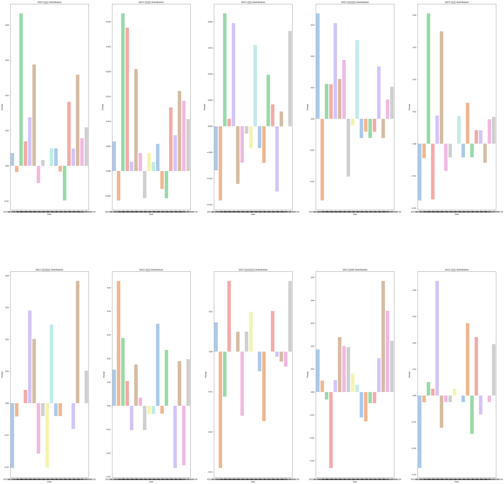

**[도서후기] 데이터분석 준전문가 with 데이터 에듀**

 

지도 교수님과의 면담을 통해 내가 현재 해야 할 일이 `자격증 취득`이라는 사실을 깨닫고 방학때 공부할 생각이었는데,

`BDAA`에서 `데이터 에듀`와 손을 잡고 ADSP스터디를 진행한다는 소식을 듣고 바로 신청했다!! 

 

[http://www.yes24.com/Product/Goods/116752070](http://www.yes24.com/Product/Goods/116752070)

---

 

2월 26일에 있을 Adsp 시험을 위해 , 앞으로 4주간의 Adsp 스터디에서 활용할 교재이다.

이 교재가 바로 그 유명한 `민트책`이다. 그동안 자격증 준비를 해볼까 하고 블로그 후기를 찾아봤을 때 항상 추천했었던 `민트책`!!

ADSP 합격하게 해주세요..

 

---

> ## 저자 소개 ##

 

이 책의 저자인 윤종식은 `데이터에듀`의 대표로,  동국대학교 산업공학과(데이터마이닝) 박사이시다.

이 분은 다수의 대기업에서 빅데이터 및 ADsP 기업 특강을 하고, 빅데이터 및 데이터 분석 프로젝트를 수행하셔서  빅데이터에 대해 빠삭하신 분이다.

 

> ## 책 구성 ##

 

> ## 장점 ## 

 

> ## 보완점 ##

 

> ## 후기 ## 

 

---
*이 후기는 데이터 에듀와 BDAA의 도서 제공으로  작성했습니다.*
